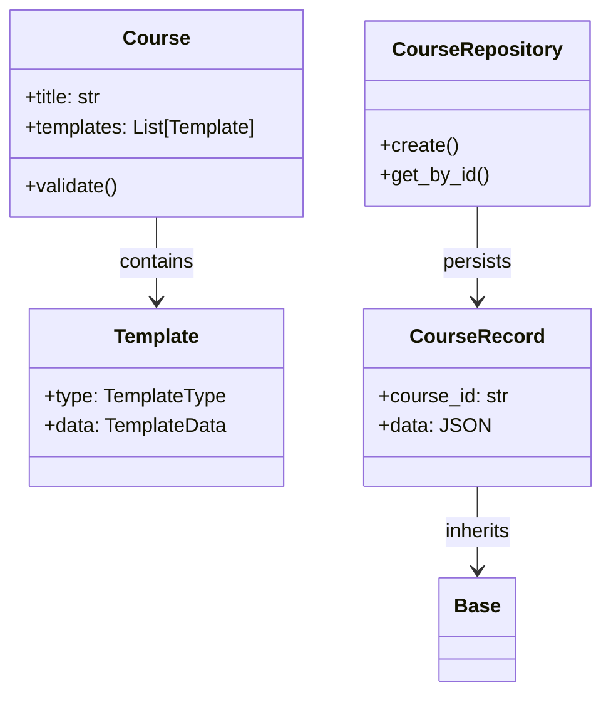
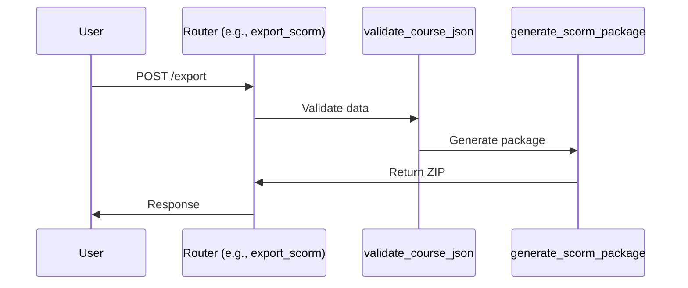

# Detailed Codebase Analysis: eLearning Backend

## 1. HIGH-LEVEL OVERVIEW

### Overall Purpose
This project is a FastAPI-based backend for an eLearning authoring platform. It allows users to create, validate, and export courses in SCORM 1.2 format for integration with Learning Management Systems (LMS). Key features include dynamic template systems (e.g., MCQ, video content), course data validation, SCORM export with sanitization, and template management APIs. It emphasizes modularity, async operations, and no hardcoding for extensibility.

### Main Modules, Packages, and Subsystems
- **app/**: Core application package.
  - **models/**: Data models (Pydantic for validation, SQLAlchemy for persistence).
  - **repositories/**: Data access layer (repository pattern for CRUD operations).
  - **routers/**: API endpoints (FastAPI routers for RESTful APIs).
  - **services/**: Business logic (e.g., SCORM export).
  - **utils/**: Utilities (e.g., validation dependencies).
  - **db/**: Database configuration and session management.
- **alembic/**: Database migration tool (Alembic setup for schema changes).
- **tests/**: Unit and integration tests (using pytest).
- **Root-level scripts**: `run_dev.sh`, `build.sh`, `start.sh` for development and deployment.

### Relationships Between Parts
- **Routers** handle HTTP requests, depend on **repositories** for data access, and use **services** for complex logic (e.g., SCORM export).
- **Models** provide validation (Pydantic) and persistence (SQLAlchemy), bridged by repositories.
- **Utils** (e.g., validation) are injected as dependencies in routers.
- **Alembic** manages schema migrations based on SQLAlchemy models.
- Tests validate the entire stack via fixtures and mocks.
- The system follows a layered architecture: API → Business Logic → Data Access → Database.

### Application Entry Points and Main Execution Flow
- **Primary Entry Point**: `app/main.py` (FastAPI app instance, runs via `uvicorn` or `run_dev.sh`).
- **Execution Flow**: On startup, load environment variables, initialize database (auto-migrate if enabled), set up CORS, include routers, and start the server. API requests flow through routers → validation → repositories/services → database. For SCORM export, it involves validation, file generation, and packaging.

## 2. FILE-BY-FILE BREAKDOWN

Based on the coding instructions and provided files, here's a breakdown of key Python files. Assumptions: Files like `app/main.py` are described based on standard FastAPI setup from instructions; unprovided files are inferred.

- **`app/main.py`**
  - Role: Application entry point; initializes FastAPI app, sets up CORS, includes routers, and handles global exceptions.
  - Important Functions/Classes: `app = FastAPI()` instance; `startup_event()` for auto-migrations; exception handlers for HTTP errors.
  - Summaries: `startup_event()` runs Alembic upgrades if `AUTO_MIGRATE=true`. Routers are included with prefixes (e.g., `/api/v1`).
  - Dependencies: FastAPI, routers, `app.db.config`, Alembic.

- **`app/db/config.py`**
  - Role: Database configuration and session management.
  - Important Functions/Classes: `get_session()` async dependency for SQLAlchemy sessions.
  - Summaries: `get_session()` yields an `AsyncSession` for repositories; handles engine creation with async drivers (e.g., aiosqlite for SQLite).
  - Dependencies: SQLAlchemy, environment variables (e.g., `DATABASE_URL`).

- **`app/models/course.py`**
  - Role: Pydantic models for in-memory validation of course data.
  - Important Classes: `Course`, `Template`, `TemplateData`, `TemplateType` (enum for types like 'mcq').
  - Summaries: `Course` validates structure (e.g., templates array); includes validators for ordering and MCQ normalization.
  - Dependencies: Pydantic (v1/v2 compatibility shims).

- **`app/models/persisted_course.py`**
  - Role: SQLAlchemy ORM models for database persistence.
  - Important Classes: `CourseRecord`, `TemplateRecord`, `Base` (declarative base).
  - Summaries: `CourseRecord` stores JSON blobs and metadata; `TemplateRecord` normalizes templates with foreign keys.
  - Dependencies: SQLAlchemy.

- **app/repositories/course_repository.py** (assumed based on instructions)
  - Role: Repository for course CRUD operations.
  - Important Classes: `CourseRepository`.
  - Summaries: Methods like `create()`, `get_by_id()`; raises `CourseNotFoundError`; commits internally.
  - Dependencies: `AsyncSession`, `persisted_course` models.

- **app/repositories/template_repository.py** (assumed)
  - Role: Repository for template operations scoped to courses.
  - Important Classes: `TemplateRepository`.
  - Summaries: Maintains `order_index`; methods like `add_to_course()`.
  - Dependencies: `AsyncSession`, `persisted_course` models.

- **`app/routers/courses.py`** (assumed)
  - Role: API endpoints for course management.
  - Important Functions: `create_course()`, `get_course()`, `export_scorm()`.
  - Summaries: Handles POST/GET for courses; injects `validate_course_json` for export.
  - Dependencies: FastAPI, repositories, services.

- **`app/services/scorm_export.py`**
  - Role: Generates SCORM 1.2 packages.
  - Important Functions: `generate_scorm_package()`, `_validate_templates_for_scorm()`, `_sanitize_data_dynamic()`.
  - Summaries: Validates templates, generates files (e.g., `imsmanifest.xml`), sanitizes data; handles MCQ and media.
  - Dependencies: BeautifulSoup for sanitization, repositories.

- **`app/utils/validation.py`**
  - Role: Validation dependencies for courses.
  - Important Functions: `validate_course_json()`, `CourseValidator`.
  - Summaries: Two-stage validation (Pydantic + business rules); normalizes MCQ formats.
  - Dependencies: Pydantic models.

- **`alembic/env.py`** (provided)
  - Role: Alembic environment for migrations.
  - Important Functions: `get_database_url()`, `run_migrations_offline()`, `run_migrations_online()`.
  - Summaries: `get_database_url()` converts async URLs to sync for migrations; configures context with metadata.
  - Dependencies: SQLAlchemy, Alembic, dotenv.

- **`tests/test_courses_api.py`** (assumed)
  - Role: Tests for course APIs.
  - Important Functions: Test functions like `test_export_validates_template_ordering()`.
  - Summaries: Uses `test_client` fixture; covers validation and export.
  - Dependencies: pytest, FastAPI TestClient.

Assumptions: Other files (e.g., in routers/, tests/) follow similar patterns; full repo scan would confirm exact implementations.

## 3. FUNCTION & CLASS MAP (WITH FILE PATHS)

- **FastAPI App Instance**  
  - File: `app/main.py`  
  - Purpose: Central app object for routing and middleware.  
  - Called by: Uvicorn on startup.  
  - Calls: Routers, startup_event().

- **get_session**  
  - File: `app/db/config.py`  
  - Purpose: Provides async database sessions.  
  - Called by: Repositories, routers.  
  - Calls: SQLAlchemy engine.

- **Course** (Pydantic Model)  
  - File: `app/models/course.py`  
  - Purpose: Validates course structure.  
  - Called by: validate_course_json().  
  - Calls: Template validators.

- **CourseRecord** (SQLAlchemy Model)  
  - File: `app/models/persisted_course.py`  
  - Purpose: Persists course data.  
  - Called by: CourseRepository.  
  - Calls: None (ORM).

- **CourseRepository.create**  
  - File: app/repositories/course_repository.py  
  - Purpose: Inserts new courses.  
  - Called by: Routers (e.g., create_course).  
  - Calls: get_session().

- **generate_scorm_package**  
  - File: `app/services/scorm_export.py`  
  - Purpose: Builds SCORM ZIP.  
  - Called by: Routers (e.g., export_scorm).  
  - Calls: _validate_templates_for_scorm(), _sanitize_data_dynamic().

- **validate_course_json**  
  - File: `app/utils/validation.py`  
  - Purpose: Validates course data before export.  
  - Called by: Routers as dependency.  
  - Calls: CourseValidator.

- **get_database_url**  
  - File: `alembic/env.py`  
  - Purpose: Constructs DB URL for migrations.  
  - Called by: Migration runners.  
  - Calls: os.getenv().

Assumptions: Maps are based on key entities; full scan would expand this.

## 4. DIAGRAMS (USE MERMAID)

### A. Project Architecture Diagram
```mermaid
graph TD
    A[app/main.py] --> B[app/routers/]
    B --> C[app/services/scorm_export.py]
    B --> D[app/repositories/]
    D --> E[app/db/config.py]
    E --> F[Database (SQLite/PostgreSQL)]
    C --> G[app/utils/validation.py]
    G --> H[app/models/course.py]
    D --> I[app/models/persisted_course.py]
    J[alembic/env.py] --> F
```

### B. Class Diagram


### C. Function Call Sequence Diagram


### D. Data Flow Diagram
```mermaid
flowchart TD
    A[User Input (JSON)] --> B[Router]
    B --> C[Validation (Pydantic)]
    C --> D[Repository]
    D --> E[Database (CourseRecord)]
    E --> F[SCORM Export Service]
    F --> G[ZIP Package]
    G --> H[User Download]
```

## 5. EXECUTION FLOW (STEP-BY-STEP)

### Main Entry Point
- `app/main.py`: Starts with `uvicorn app.main:app`.

### Runtime Flow
1. Load env vars (e.g., `DATABASE_URL`).
2. Initialize FastAPI app, CORS, and routers.
3. Run `startup_event()`: Auto-migrate if enabled.
4. Server listens; on request (e.g., export), router calls `validate_course_json()`.
5. Validation parses JSON to Pydantic models.
6. Repository fetches data; service generates SCORM files.
7. Return response.

### Simplified Pseudocode
```python
if __name__ == "main":
    load_env()
    app = FastAPI()
    include_routers()
    startup_event()  # alembic upgrade
    uvicorn.run(app)
    
def export_endpoint(course_data):
    validated = validate_course_json(course_data)
    package = generate_scorm_package(validated)
    return package
```

## 6. DESIGN PATTERNS & IMPORTANT DETAILS

### Patterns
- **Repository Pattern**: Abstracts data access (e.g., CourseRepository).
- **Dependency Injection**: FastAPI dependencies (e.g., get_session).
- **Layered Architecture**: API → Service → Repository → DB.
- **Factory/Validator**: Pydantic for model creation/validation.

### External Libraries
- **FastAPI**: Web framework.
- **SQLAlchemy**: ORM/async DB.
- **Pydantic**: Validation.
- **Alembic**: Migrations.
- **BeautifulSoup**: Sanitization.

### Configuration
- Env vars: `DATABASE_URL`, `CORS_ORIGINS`, `AUTO_MIGRATE`.
- No config files; loaded via dotenv.

### Async/Background
- All DB ops async; no schedulers mentioned.

## 7. QUALITY ANALYSIS & IMPROVEMENTS

### Issues
- Missing docstrings in many files (e.g., functions lack descriptions).
- Potential redundancy: MCQ normalization logic could be centralized.
- Fragile: Pydantic v1/v2 shims; hardcoded limits (e.g., 100 templates).

### Suggestions
- Add type hints and docstrings everywhere.
- Refactor validation into a single service.
- Improve error handling for async ops.

## 8. DOCUMENTATION PACKAGE

### README.md
```markdown
# eLearning Backend

A FastAPI backend for eLearning course authoring and SCORM export.

## Setup
1. Clone repo.
2. Run `./run_dev.sh` (creates venv, installs deps).

## Running
- Dev: `uvicorn app.main:app --reload`
- Prod: Use `render.yaml`.

## Testing
- `pytest` for all tests.

## Architecture
- Layered: Routers → Services → Repositories → DB.
- Uses async SQLAlchemy and Pydantic validation.

## Extending
- Add templates in `course.py`; update SCORM logic in `scorm_export.py`.
```
