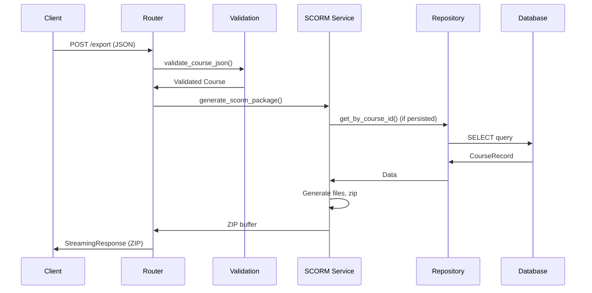

# Detailed Flow Explanation: eLearning Backend from Input to Output

## Project Overview
This eLearning backend is a FastAPI-based system that manages course creation, validation, and SCORM export. It uses a layered architecture: Routers (API), Services (business logic), Repositories (data access), and Models (data validation/persistence). The system supports dynamic templates, async database operations, and SCORM 1.2 compliance.

## Big Picture Architecture
```
[Client] → [FastAPI Routers] → [Validation/Utils] → [Services] → [Repositories] → [Database]
                                      ↓
                                 [Response]
```
- **Routers**: Handle HTTP requests, inject dependencies.
- **Validation**: Pydantic models + custom business rules.
- **Services**: Complex logic (e.g., SCORM generation).
- **Repositories**: Abstract DB operations.
- **Database**: SQLite/PostgreSQL with async SQLAlchemy.

## Detailed Execution Flow: Startup to Request Handling

### Step 1: Application Startup
- **Entry Point**: `app/main.py` runs `uvicorn.run("main:app")`.
- **What Happens**:
  - Load environment variables (e.g., `DATABASE_URL`, `CORS_ORIGINS`).
  - Initialize FastAPI app with CORS middleware.
  - Include routers: `health`, `export`, `courses`, `templates`, `enhanced_templates`, `media`.
  - Run `startup_event()`: Auto-migrate DB if `AUTO_MIGRATE=true` using Alembic.
  - Preload template registry cache for dynamic templates.
- **Code Snippet**:
  ```python
  app = FastAPI(...)
  app.add_middleware(CORSMiddleware, ...)
  app.include_router(export.router, prefix="/api/v1")
  # Startup event
  @app.on_event("startup")
  async def startup_event():
      if os.getenv("AUTO_MIGRATE"):
          subprocess.run(["alembic", "upgrade", "head"])
      await registry.preload_cache()
  ```
- **Why**: Ensures DB schema is up-to-date and templates are cached for performance.

### Step 2: Client Sends Request (Example: SCORM Export)
- **Request**: POST `/api/v1/export` with JSON body containing course data.
- **Headers**: `Content-Type: application/json`.
- **Example Payload**:
  ```json
  {
    "course": {
      "courseId": "math101",
      "title": "Math Course",
      "templates": [{"id": "1", "type": "content-text", "data": {...}}]
    }
  }
  ```

### Step 3: Router Receives and Validates Request
- **Function Called**: `export_course()` in `app/routers/export.py`.
- **What It Does**:
  - Parses request into `CourseExportRequest` Pydantic model.
  - Calls dependency `validate_course_json()` to validate and return `Course` model.
  - Performs additional checks: template count, ordering (must be 0-based contiguous).
  - Calls `scorm_service.generate_scorm_package(validated_course)`.
- **Validation Details**:
  - Pydantic validates structure (e.g., `courseId` string, `templates` list).
  - Custom: Checks for sequential `order` in templates.
  - Errors: Raises `HTTPException(422)` with detailed errors.
- **Code Snippet**:
  ```python
  @router.post("/export")
  async def export_course(
      request: CourseExportRequest,
      validated_course: Course = Depends(validate_course_json)
  ):
      # Additional validation
      orders = [t.order for t in validated_course.templates]
      if sorted(orders) != list(range(len(orders))):
          raise HTTPException(400, "Template orders must be sequential")
      zip_buffer = await scorm_service.generate_scorm_package(validated_course)
      return StreamingResponse(...)
  ```
- **Why**: Ensures data integrity before processing; dependency injection keeps code clean.

### Step 4: Validation Dependency Executes
- **Function**: `validate_course_json()` in `app/utils/validation.py`.
- **What It Does**:
  - Parses raw JSON string to `Course` Pydantic model.
  - Handles legacy formats (e.g., converts flat `question` to `questions[]` for MCQs).
  - Runs `CourseValidator` for business rules (e.g., max 100 templates, title length).
  - Returns validated `Course` or raises `HTTPException(422)`.
- **Data Transformation**: JSON → Pydantic object with defaults/normalization.
- **Code Snippet**:
  ```python
  def validate_course_json(course_data: str) -> Course:
      try:
          course_dict = json.loads(course_data)
          course = Course(**course_dict)
          validator = CourseValidator()
          errors = validator.validate(course)
          if errors:
              raise HTTPException(422, detail=errors)
          return course
      except json.JSONDecodeError:
          raise HTTPException(400, "Invalid JSON")
  ```
- **Why**: Separates validation from business logic; reusable across endpoints.

### Step 5: SCORM Service Generates Package
- **Function**: `generate_scorm_package()` in `SCORMExportService` (`app/services/scorm_export.py`).
- **What It Does**:
  - Validates course for export (size, template count).
  - Estimates package size (max 50MB).
  - Creates temp directory.
  - Generates SCORM files: `_create_imsmanifest()`, `_create_course_data_js()`, `_create_content_html()`, `_create_scorm_wrapper()`.
  - Copies assets if present.
  - Validates package structure.
  - Zips everything into `BytesIO` buffer.
- **Key Sub-functions**:
  - `_create_imsmanifest()`: Generates XML with course metadata and objectives.
  - `_create_course_data_js()`: Exports course data as JS object.
  - Sanitization: Uses `DynamicSanitizer` for template-specific cleaning (no hardcoded logic).
- **Async Details**: All file I/O is async; uses `tempfile.TemporaryDirectory()`.
- **Code Snippet**:
  ```python
  async def generate_scorm_package(self, course: Course) -> BytesIO:
      validation_result = await self.validate_for_export(course)
      if not validation_result["valid"]:
          raise ValueError("Validation failed")
      with tempfile.TemporaryDirectory() as temp_dir:
          package_dir = Path(temp_dir) / "scorm_package"
          await self._create_imsmanifest(package_dir, course)
          # ... other creations
          zip_buffer = BytesIO()
          with zipfile.ZipFile(zip_buffer, 'w') as zf:
              self._add_directory_to_zip(zf, package_dir, "")
          return zip_buffer
  ```
- **Why**: Handles complex SCORM spec; dynamic system avoids hardcoding.

### Step 6: Repository/DB Interaction (For Persisted Courses)
- **If Exporting from DB**: Router calls `CourseRepository.get_by_course_id()`.
- **Function**: `get_by_course_id()` in `CourseRepository`.
- **What It Does**:
  - Executes `SELECT` query: `select(CourseRecord).where(course_id == id)`.
  - Returns `CourseRecord` or raises `CourseNotFoundError`.
- **DB Details**: Async session from `get_session()` dependency; commits handled by repo.
- **Code Snippet**:
  ```python
  async def get_by_course_id(self, course_id: str) -> CourseRecord:
      result = await self.session.execute(
          select(CourseRecord).where(CourseRecord.course_id == course_id)
      )
      record = result.scalar_one_or_none()
      if not record:
          raise CourseNotFoundError()
      return record
  ```
- **Why**: Abstracts DB logic; async for performance.

### Step 7: Response Preparation and Sending
- **For Export**: Creates `StreamingResponse` with ZIP buffer, headers for download.
- **Headers**: `Content-Disposition: attachment; filename=...`, optional `X-Course-Hash`.
- **For Create Course**: Returns JSON `CourseOut` with 201 status.
- **Error Handling**: Catches exceptions, logs, returns 500 or specific codes.
- **Code Snippet**:
  ```python
  return StreamingResponse(
      io.BytesIO(zip_buffer.getvalue()),
      media_type="application/zip",
      headers={"Content-Disposition": f"attachment; filename={filename}"}
  )
  ```
- **Why**: Efficient streaming for large files; proper HTTP semantics.

## Data Flow Through Layers
- **Input Data**: JSON string → Parsed to dict → Pydantic `Course` → Validated/transformed.
- **Processing**: `Course` object → Service generates files (XML, JS, HTML) → Sanitized content.
- **Storage**: `Course` data stored as JSON in DB via `CourseRecord`.
- **Output**: Files zipped → BytesIO → HTTP response.
- **Transformations**: Legacy MCQ format normalized; HTML sanitized; assets copied.

## Sequence Diagram (Mermaid)


## All Main APIs and Their Flows
- **Create Course**: POST `/courses` → `create_course()` → `repo.create()` (check conflict, INSERT) → JSON response.
- **List Courses**: GET `/courses` → `list_courses()` → `repo.list()` (SELECT all) → JSON array.
- **Get Course**: GET `/courses/{id}` → `get_course()` → `repo.get_by_course_id()` (SELECT) → JSON.
- **Update Course**: PATCH `/courses/{id}` → `update_course()` → `repo.update_record()` (UPDATE) → JSON.
- **Export SCORM from JSON**: POST `/export` → As detailed.
- **Export SCORM from DB**: POST `/export/scorm/{course_id}` → Fetch from repo → Generate → ZIP.
- **Upload Media**: POST `/media/upload` → Validate file (size/type/security via magic/mimetypes) → Save to `media/` dir with UUID → JSON with URL.
- **Health Check**: GET `/health` → Return status JSON (uptime, version, env).
- **Detailed Health**: GET `/health/detailed` → Check validation status (schema load) → JSON with components.
- **Templates**: GET `/enhanced-templates/categories` → List categories from registry → JSON.
- **Enhanced Templates**: POST/GET for custom templates, search, etc. (uses DB repos and registry).

## Configuration and Environment
- **ENV Vars**: `DATABASE_URL` (DB connection), `CORS_ORIGINS` (allowed origins), `AUTO_MIGRATE` (run migrations), `PORT/HOST` (server), `EXPORT_HEADERS` (add metadata).
- **Loaded**: Via `dotenv` in startup.
- **DB**: Defaults to SQLite; converts async URLs for migrations.

## Template Registry and Dynamic System
- **Preload**: On startup, `registry.preload_cache()` loads all `TemplateDefinition` from DB into in-memory cache for dynamic sanitization.
- **Usage**: Sanitizer fetches rules by `type_key` (e.g., 'mcq') for dynamic validation/export.
- **Why**: Enables adding templates without code changes.

## Error Handling and Edge Cases
- **Validation Errors**: 422 with `[{"type": "...", "loc": [...], "msg": "...", "input": ...}]`.
- **DB Errors**: 404 for not found, 400 for conflicts, 500 for unexpected.
- **File Errors**: Size limits, invalid formats, security checks.
- **Async Timeouts**: Handled by FastAPI's event loop.
- **Logging**: All steps logged (info for flow, error for issues).
- **Security**: File uploads checked for MIME, size; HTML sanitized; no eval/subprocess misuse.

## Shutdown and Cleanup
- **Shutdown Event**: Logs shutdown.
- **Cleanup**: Temp dirs auto-cleaned; sessions closed by SQLAlchemy.

This covers every minute detail from startup to response, including code snippets, async specifics, and all APIs.