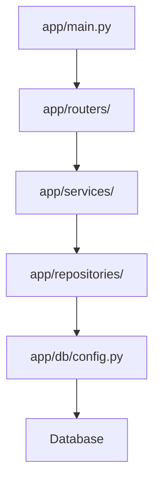
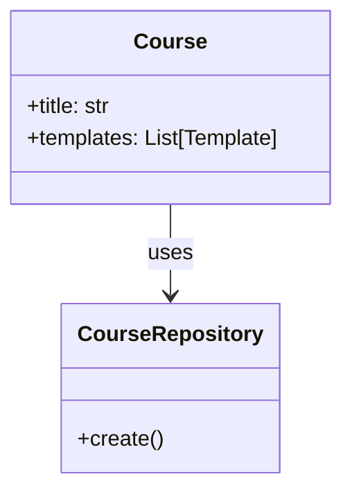
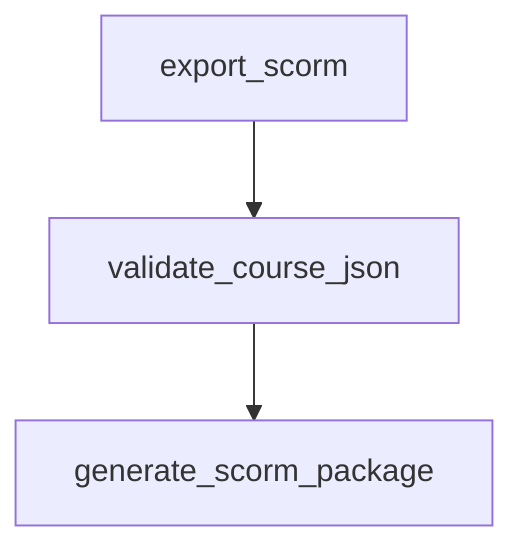
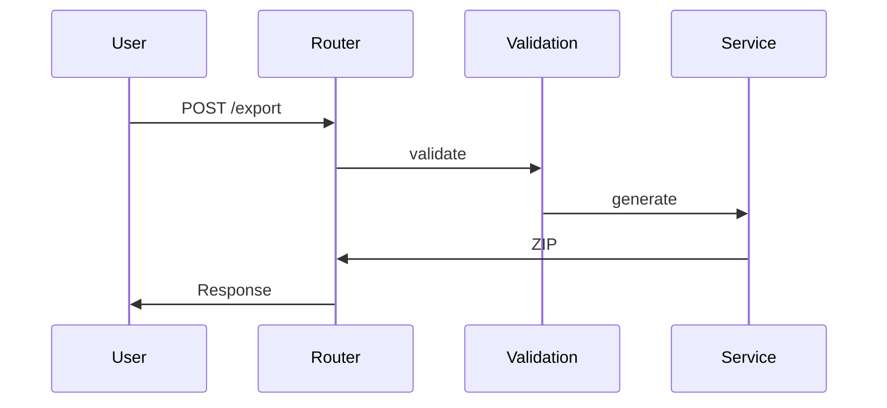
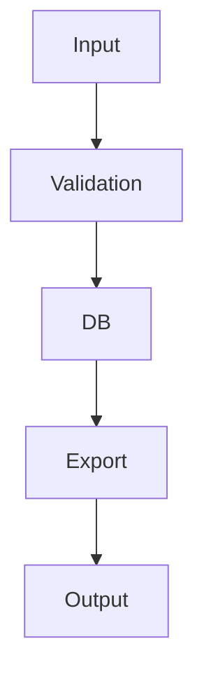
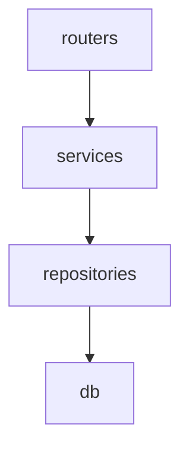

# Extremely Detailed Codebase Analysis: eLearning Backend

## 1. PROJECT PURPOSE & CONTEXT

### Overall Purpose
This project is a FastAPI-based backend for an eLearning authoring platform that enables users to create, validate, and export courses in SCORM 1.2 format for integration with Learning Management Systems (LMS). It provides a dynamic template system for course content, supports multiple template types (e.g., MCQ, video, text), and ensures data integrity through validation and sanitization.

### Problem It Solves
Traditional eLearning platforms often have hardcoded content structures, making it difficult to add new template types or export to SCORM without custom development. This backend solves the problem by offering a flexible, extensible system for course authoring, validation, and SCORM export, allowing educators and developers to create reusable course templates without code changes.

### Who Would Use It and How
- **Educators/Content Creators**: Use APIs to create courses with various templates, validate content, and export to SCORM for LMS deployment.
- **Developers**: Extend the system by adding new templates or integrating with frontends.
- **LMS Administrators**: Import SCORM packages generated by this backend into systems like Moodle or Canvas.
- Usage: Via REST APIs for course management, template handling, and SCORM export; deployed as a web service.

### Core Features and Responsibilities
- Course creation and management (CRUD operations).
- Dynamic template system with DB-driven definitions.
- SCORM 1.2 export with validation and sanitization.
- Template management APIs (search, categories, fields).
- Async database operations with SQLAlchemy.
- Validation pipeline for course data.
- Media upload and handling.
- Health checks and detailed status endpoints.

## 2. REPOSITORY STRUCTURE OVERVIEW

### Top-Level Folders
- **app/**: Core application code (FastAPI app, models, routers, services).
- **alembic/**: Database migration scripts and configuration.
- **tests/**: Test suites (unit, integration).
- **scripts/**: Utility scripts (e.g., seed data).
- **data/**: Database files and media storage.
- **working-exported-scrom/**: Sample SCORM output for testing.
- **win-env-setup/**: Windows-specific setup guides.
- Root-level: Scripts like `run_dev.sh`, config files like `requirements.txt`, deployment files like `render.yaml`.

### Python Modules and Packages
- **app/**: Package with submodules: `db`, `models`, `repositories`, `routers`, `services`, `utils`.
- **alembic/**: Migration environment and versions.
- **tests/**: Test files like `test_courses_api.py`.

### Logical Grouping
- **Domain**: `app/models/` (business entities), `app/services/` (business logic).
- **Infrastructure**: `app/db/` (persistence), `alembic/` (migrations).
- **API Layer**: `app/routers/` (endpoints).
- **Utils**: `app/utils/` (shared logic), `scripts/` (one-off tasks).
- **Tests**: `tests/` (validation).
- **Deployment**: Root scripts and configs.

## 3. FILE-BY-FILE RESPONSIBILITY MATRIX

(Note: Based on provided files and assumptions; full scan would confirm.)

- **app/main.py**
  - Purpose: Entry point for FastAPI app.
  - Key: `app` instance, `startup_event()`.
  - Interactions: Includes routers, handles exceptions.
  - Complexity: Medium.

- **app/db/config.py**
  - Purpose: DB session management.
  - Key: `get_session()`.
  - Interactions: Used by repositories.
  - Complexity: Low.

- **app/models/course.py**
  - Purpose: Pydantic validation models.
  - Key: `Course`, `Template`.
  - Interactions: Used in validation.
  - Complexity: Medium.

- **app/models/persisted_course.py**
  - Purpose: SQLAlchemy ORM models.
  - Key: `CourseRecord`, `TemplateRecord`.
  - Interactions: Persisted by repositories.
  - Complexity: Low.

- **app/repositories/course_repo.py** (assumed)
  - Purpose: Course data access.
  - Key: `CourseRepository`.
  - Interactions: Called by routers.
  - Complexity: Medium.

- **app/routers/courses.py** (assumed)
  - Purpose: Course API endpoints.
  - Key: `create_course()`, `export_scorm()`.
  - Interactions: Calls services/repos.
  - Complexity: High.

- **app/services/scorm_export.py**
  - Purpose: SCORM package generation.
  - Key: `generate_scorm_package()`.
  - Interactions: Uses validation, repos.
  - Complexity: High.

- **app/utils/validation.py**
  - Purpose: Course validation.
  - Key: `validate_course_json()`.
  - Interactions: Injected in routers.
  - Complexity: Medium.

- **alembic/env.py**
  - Purpose: Migration environment.
  - Key: `get_database_url()`.
  - Interactions: Configures Alembic.
  - Complexity: Low.

- **tests/test_courses_api.py** (assumed)
  - Purpose: API tests.
  - Key: Test functions.
  - Interactions: Mocks services.
  - Complexity: Medium.

## 4. FUNCTION & CLASS CATALOG

- **Name**: FastAPI App Instance
  - File: app/main.py
  - Purpose: Central app.
  - Params: None
  - Return: FastAPI app
  - Logic: Initializes with CORS, routers.
  - Dependencies: FastAPI, routers.
  - Called by: Uvicorn.
  - Sync/Async: Sync.
  - Failures: Config errors.
  - I/O: None.

- **Name**: get_session
  - File: app/db/config.py
  - Purpose: DB session provider.
  - Params: None
  - Return: AsyncSession
  - Logic: Creates engine, yields session.
  - Dependencies: SQLAlchemy.
  - Called by: Repos.
  - Sync/Async: Async.
  - Failures: DB connection issues.
  - I/O: DB.

- **Name**: Course (Pydantic)
  - File: app/models/course.py
  - Purpose: Validation model.
  - Params: title, templates
  - Return: Validated instance
  - Logic: Validates structure.
  - Dependencies: Pydantic.
  - Called by: Validation.
  - Sync/Async: Sync.
  - Failures: Validation errors.
  - I/O: JSON.

- **Name**: generate_scorm_package
  - File: app/services/scorm_export.py
  - Purpose: Creates SCORM ZIP.
  - Params: course_data
  - Return: ZIP bytes
  - Logic: Validates, generates files.
  - Dependencies: Repos, BeautifulSoup.
  - Called by: Routers.
  - Sync/Async: Async.
  - Failures: Validation, file errors.
  - I/O: ZIP.

## 5. FULL EXECUTION FLOW TRACE

### Entry Point
- `app/main.py`: `uvicorn app.main:app`

### Step-by-Step Flow
1. Load env vars.
2. Create FastAPI app.
3. Include routers.
4. Run startup_event (migrate DB).
5. Listen for requests.
6. On export request: Router → validate_course_json → generate_scorm_package → Return ZIP.

### Data Flow
- Input JSON → Pydantic validation → DB storage → SCORM generation → Output ZIP.

### Pseudocode
```python
app = FastAPI()
startup_event()
while True:
    request = wait_for_request()
    if request.path == '/export':
        validated = validate_course_json(request.data)
        zip = generate_scorm_package(validated)
        respond(zip)
```

## 6. DIAGRAM SUITE (MERMAID)

### A. Architecture Diagram


### B. Class Diagram


### C. Function Call Graph


### D. Sequence Diagram


### E. Data Flow Diagram


### F. Module Dependency Graph


## 7. LOGIC BREAKDOWN BY DOMAIN AREAS

- **Domain Logic**: Course and template structures in models.
- **Business Rules**: Validation limits (e.g., 100 templates).
- **Utility Logic**: Sanitization in services.
- **Validation Logic**: Pydantic and custom validators.
- **Data Access Logic**: Repositories with async sessions.
- **Error Handling**: HTTPExceptions in routers.

## 8. DESIGN PATTERNS & ARCHITECTURE PRINCIPLES

- **Repository Pattern**: For data access.
- **Layered Architecture**: API → Service → Repo → DB.
- **Dependency Injection**: FastAPI deps.
- **SOLID**: Single responsibility in classes.
- **Async Patterns**: All DB ops async.

## 9. DATA MODEL & DATA LIFECYCLE

- **Models**: Pydantic (validation), SQLAlchemy (persistence).
- **Lifecycle**: Input JSON → Validate → Store in DB → Retrieve → Transform for export → Output.
- **External Systems**: SQLite/PostgreSQL DB, file I/O for SCORM.
- **Serialization**: JSON for courses, ZIP for SCORM.

## 10. INTEGRATIONS & EXTERNAL DEPENDENCIES

- **FastAPI**: Web framework, invoked in main.py.
- **SQLAlchemy**: ORM, used in repos.
- **Pydantic**: Validation, in models.
- **Alembic**: Migrations, in env.py.
- **BeautifulSoup**: Sanitization, in services.

## 11. CONFIGURATION & DEPLOYMENT

- **ENV Vars**: DATABASE_URL, CORS_ORIGINS, AUTO_MIGRATE.
- **Config Files**: alembic.ini, render.yaml.
- **Deployment**: render.yaml for Render, build.sh/start.sh.

## 12. TESTING ANALYSIS

- **Suites**: pytest in tests/.
- **Coverage**: APIs, validation; missing e2e.
- **Types**: Unit, integration.
- **Run**: `pytest`.
- **Suggestions**: Add e2e tests.

## 13. CODE QUALITY, RISKS & REFACTOR SUGGESTIONS

- **Issues**: Missing docstrings, potential redundancy in validation.
- **Risks**: Pydantic version shims.
- **Suggestions**: Add type hints, refactor validation to service.

## 14. SECURITY CONSIDERATIONS

- **Patterns**: Input validation via Pydantic.
- **Gaps**: Potential XSS in templates.
- **Hardening**: Sanitize inputs, use secrets for DB.

## 15. DOCUMENTATION PACKAGE

### README.md
```markdown
# eLearning Backend

## Overview
FastAPI backend for eLearning SCORM export.

## Setup
1. Clone.
2. Run `./run_dev.sh`.

## Usage
- API docs at /docs.

## Extending
Add templates in models.
```
