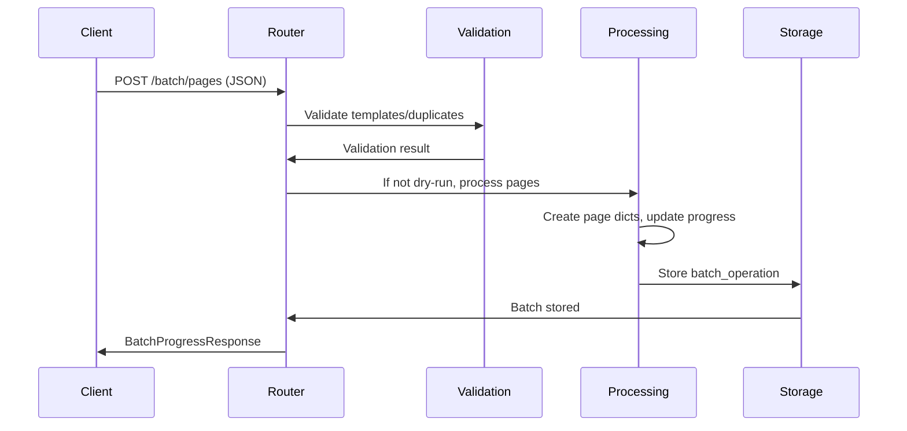

# Detailed Page Creation Flow: Batch Pages from Templates

## Overview
Page creation in this eLearning backend allows adding multiple pages to a course using templates. The main endpoint is POST `/api/v1/templates/enhanced/batch/pages` for batch creation. It supports validation, dry-run, progress tracking, and error handling. Pages are created from templates (hardcoded in MVP, not dynamic registry yet).

## Big Picture Flow
```
[Client] → [Enhanced Templates Router] → [Validation] → [Batch Processing] → [In-Memory Storage]
                                      ↓
                                 [Progress Response]
```
- **Router**: Handles batch request, validates input.
- **Validation**: Checks templates exist, no duplicates.
- **Processing**: Simulates page creation, tracks progress.
- **Storage**: Stores in BATCH_OPERATIONS dict (in-memory).
- **Response**: BatchProgressResponse with status, created pages, errors.

## Detailed Execution Flow: Batch Page Creation

### Step 1: Client Sends Request
- **Request**: POST `/api/v1/templates/enhanced/batch/pages?course_id=123` with JSON body.
- **Headers**: `Content-Type: application/json`.
- **Example Payload**:
  ```json
  {
    "pages": [
      {
        "templateId": "mcq",
        "title": "Quiz 1",
        "content": {"question": "What is 2+2?"},
        "configuration": {},
        "tags": ["math"]
      }
    ],
    "dryRun": false
  }
  ```

### Step 2: Router Receives and Validates Request
- **Function Called**: `create_pages_batch()` in `app/routers/enhanced_templates.py`.
- **What It Does**:
  - Parses request into `BatchPageCreateRequest` Pydantic model.
  - Generates `batch_id` (e.g., "batch_1_1732896000").
  - Validates: Checks for duplicate titles, verifies templates exist in `TEMPLATES + CUSTOM_TEMPLATES`.
  - If `dryRun=true`, returns validation result without creation.
  - If errors, returns failed response.
- **Validation Details**:
  - Pydantic validates structure (pages array, templateId strings).
  - Custom: Template existence check against hardcoded lists.
  - Errors: Returns `BatchProgressResponse` with errors array.
- **Code Snippet**:
  ```python
  @router.post("/batch/pages")
  async def create_pages_batch(course_id: int, request: BatchPageCreateRequest):
      batch_id = f"batch_{len(BATCH_OPERATIONS) + 1}_{timestamp}"
      # Validate duplicates
      titles = [page.title for page in request.pages]
      if len(titles) != len(set(titles)):
          validation_errors.append({"error": "Duplicate page titles"})
      # Check templates
      for page_req in request.pages:
          template_exists = any(t["templateId"] == page_req.templateId for t in TEMPLATES + CUSTOM_TEMPLATES)
          if not template_exists:
              validation_errors.append({"error": f"Template '{page_req.templateId}' not found"})
      if request.dryRun or validation_errors:
          return BatchProgressResponse(status="completed" if request.dryRun else "failed", errors=validation_errors)
  ```
- **Why**: Ensures data integrity; dry-run for preview.

### Step 3: Batch Operation Setup
- **What Happens**:
  - Creates `batch_operation` dict with status "processing", progress 0.0, estimated time (2s per page).
  - Stores in `BATCH_OPERATIONS[batch_id]` (global in-memory dict).
- **Code Snippet**:
  ```python
  batch_operation = {
      "batchId": batch_id,
      "status": "processing",
      "progress": 0.0,
      "totalItems": len(request.pages),
      "createdPages": [],
      "errors": [],
      "startedAt": datetime.utcnow().isoformat()
  }
  BATCH_OPERATIONS[batch_id] = batch_operation
  ```
- **Why**: Tracks progress for async-like behavior; in-memory for MVP.

### Step 4: Simulate Page Creation Processing
- **What It Does**:
  - Loops through `request.pages`.
  - For each: Creates `new_page` dict with id, courseId, templateId, title, content, etc.
  - Updates `batch_operation` progress and `createdPages`.
  - Catches exceptions, adds to errors.
- **Data Transformation**: Request fields → Page dict with timestamps, order.
- **Code Snippet**:
  ```python
  created_pages = []
  for i, page_req in enumerate(request.pages):
      try:
          new_page = {
              "id": f"page_{batch_id}_{i}",
              "courseId": course_id,
              "templateId": page_req.templateId,
              "title": page_req.title,
              "content": page_req.content or {},
              "configuration": page_req.configuration or {},
              "tags": page_req.tags or [],
              "createdAt": datetime.utcnow().isoformat(),
              "order": i
          }
          created_pages.append(new_page)
          batch_operation["processedItems"] = i + 1
          batch_operation["progress"] = ((i + 1) / len(request.pages)) * 100
      except Exception as e:
          batch_operation["errors"].append({"error": str(e)})
  ```
- **Why**: Simulates creation; progress for UI feedback.

### Step 5: Finalize Batch Operation
- **What Happens**:
  - Sets status to "completed" or "failed" based on errors.
  - Adds `completedAt`, sets `estimatedTimeRemaining` to 0.
  - Returns `BatchProgressResponse(**batch_operation)`.
- **Code Snippet**:
  ```python
  if batch_operation["errors"]:
      batch_operation["status"] = "failed"
  else:
      batch_operation["status"] = "completed"
  batch_operation["completedAt"] = datetime.utcnow().isoformat()
  return BatchProgressResponse(**batch_operation)
  ```
- **Why**: Provides final status; errors if any creation failed.

## Data Flow Through Layers
- **Input Data**: JSON pages array → Pydantic `BatchPageCreateRequest` → Validated.
- **Processing**: Each page → New page dict → Added to batch.
- **Storage**: Batch operation stored in `BATCH_OPERATIONS` dict.
- **Output**: Progress response with created pages or errors.
- **Transformations**: Request fields mapped to page structure; order assigned sequentially.

## Sequence Diagram (Mermaid)


## Functions and Services Used
- **Router Function**: `create_pages_batch()` - Main handler.
- **Validation**: Inline checks for templates in `TEMPLATES + CUSTOM_TEMPLATES` (hardcoded lists).
- **Models**: `BatchPageCreateRequest`, `BatchProgressResponse` from `app/models/enhanced_templates.py`.
- **No External Services**: All in-memory simulation; no DB or async repos used here.
- **Global State**: `BATCH_OPERATIONS` dict for tracking.
- **Error Handling**: Catches exceptions per page, aggregates errors.

## Key Differences from SCORM Export
- **No DB**: Uses in-memory dicts, not repositories.
- **No Async**: Synchronous processing, not async services.
- **Validation**: Template existence against hardcoded lists, not dynamic registry.
- **Output**: Progress response, not file download.

This flow handles batch page creation with validation and progress tracking, suitable for adding multiple pages at once.