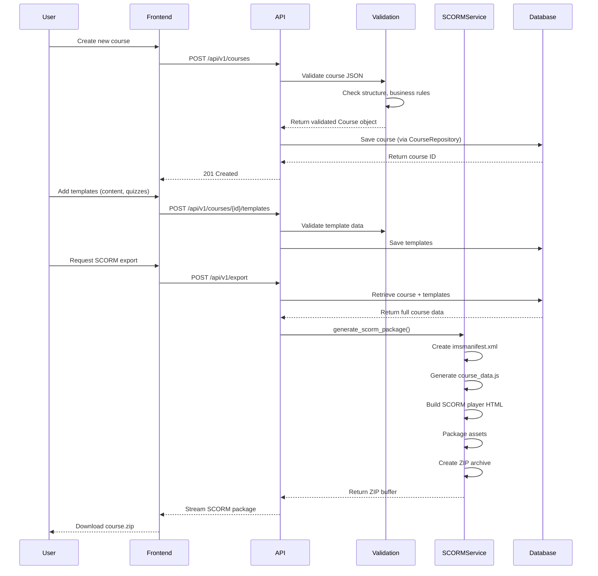
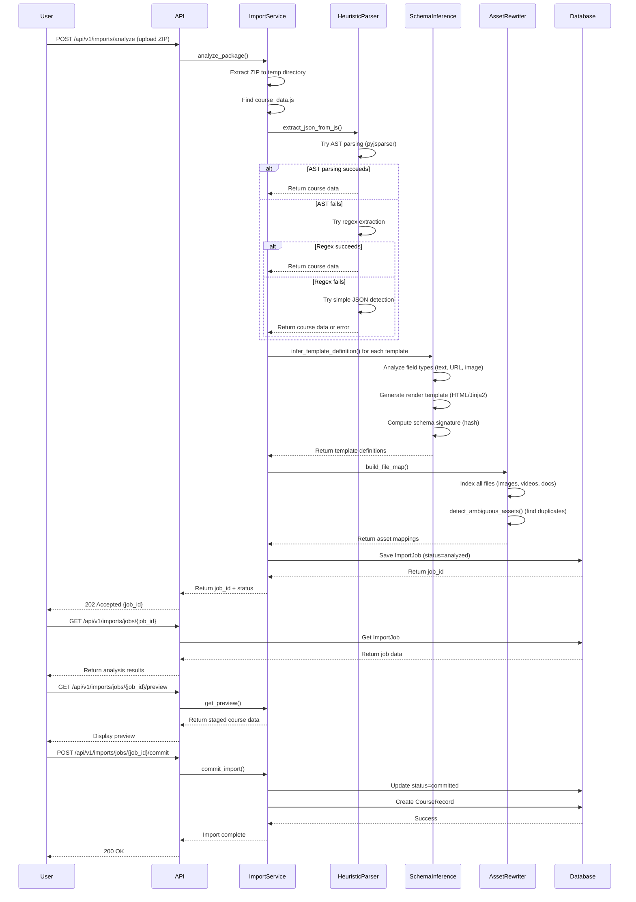

# eLearning Backend - Use Case and Application Flow

## 📋 Application Overview

This is a **FastAPI-based eLearning Content Management System** that enables the creation, validation, storage, and export of interactive e-learning courses. The system specializes in:
- **Dynamic template-based course authoring**
- **SCORM 1.2 package generation** for LMS compatibility
- **Automatic SCORM import and analysis**
- **Media asset management**
- **Interactive component support** (quizzes, branching, social features, analytics)

---

## 🎯 Primary Use Cases

### 1. Course Creation & Management
**User**: Content creators, instructional designers, LMS administrators

**What they do**:
- Create new courses with structured metadata (title, description, objectives)
- Add dynamic templates (content pages, quizzes, videos, assessments)
- Upload and manage media assets (images, videos, audio, documents)
- Define learning objectives and completion criteria
- Apply themes and branding

**Value**: Centralized content authoring with version control and validation

---

### 2. SCORM Package Export
**User**: LMS administrators, course distributors

**What they do**:
- Export courses as SCORM 1.2 compliant ZIP packages
- Validate content before export (size limits, structure, compliance)
- Download packages for upload to any SCORM-compatible LMS (Moodle, Blackboard, Canvas, etc.)

**Value**: One-click course distribution to any LMS platform

---

### 3. SCORM Package Import & Reverse Engineering
**User**: Content migration teams, course curators

**What they do**:
- Upload existing SCORM packages (ZIP files)
- Automatically extract course data from legacy formats
- Infer template schemas without predefined structures
- Review and approve imported content
- Commit analyzed courses to the database

**Value**: Migrate legacy courses without manual reconstruction

---

### 4. Interactive Component Management
**User**: Instructional designers

**What they do**:
- Add interactive quizzes (MCQ, true/false, fill-in-the-blank)
- Configure conditional branching logic
- Enable social features (comments, discussions, peer feedback)
- Track and analyze learner interactions
- Set up scoring and completion rules

**Value**: Create engaging, data-driven learning experiences

---

## 🏗️ System Architecture

```
┌─────────────────────────────────────────────────────────────┐
│                     Client Applications                      │
│        (Frontend, LMS, Content Authoring Tools)             │
└──────────────────┬──────────────────────────────────────────┘
                   │ REST API (JSON)
                   ▼
┌─────────────────────────────────────────────────────────────┐
│                   FastAPI Application                        │
├─────────────────────────────────────────────────────────────┤
│  Routers (API Endpoints)                                     │
│  ├─ Courses     ├─ Templates    ├─ Export                  │
│  ├─ Import      ├─ Media        ├─ Themes                  │
│  ├─ Analytics   ├─ Social       ├─ Branching               │
├─────────────────────────────────────────────────────────────┤
│  Validation Layer (Pydantic Models)                          │
│  - Schema validation                                         │
│  - Business rule enforcement                                 │
│  - Data normalization                                        │
├─────────────────────────────────────────────────────────────┤
│  Services (Business Logic)                                   │
│  ├─ SCORM Export Service    ├─ Import Service              │
│  ├─ Template Registry       ├─ Sanitization                │
│  ├─ Schema Inference        ├─ Asset Management            │
├─────────────────────────────────────────────────────────────┤
│  Repositories (Data Access Layer)                            │
│  ├─ Course Repository       ├─ Template Repository         │
│  ├─ Media Repository         ├─ Import Job Repository      │
├─────────────────────────────────────────────────────────────┤
│  ORM Models (SQLAlchemy)                                     │
│  - CourseRecord   - TemplateRecord   - ComponentType        │
│  - MediaAsset     - ImportJob        - PageComponent        │
└──────────────────┬──────────────────────────────────────────┘
                   │
                   ▼
┌─────────────────────────────────────────────────────────────┐
│          Database (SQLite/PostgreSQL)                        │
│  - Async operations (asyncio + aiosqlite/asyncpg)           │
│  - Alembic migrations                                        │
└─────────────────────────────────────────────────────────────┘
```

---

## 🔄 Key Application Flows

### Flow 1: Course Creation & SCORM Export



**Step-by-Step Details**:

1. **Course Creation**
   - User submits JSON with course metadata
   - API validates structure using Pydantic models
   - Business rules checked (max 100 templates, title length, etc.)
   - Course persisted to database
   - Unique `courseId` generated

2. **Template Addition**
   - Dynamic templates loaded from registry
   - Each template validated against type schema
   - Data sanitized (XSS prevention, HTML cleaning)
   - Templates linked to course with order/sequence

3. **SCORM Package Generation**
   - Validate course for export (size < 50MB, structure complete)
   - Generate `imsmanifest.xml` with course metadata
   - Create `course_data.js` with all template data
   - Build SCORM API wrapper (`scorm_wrapper.js`)
   - Create HTML player with navigation
   - Package all files into ZIP
   - Stream to client

---

### Flow 2: SCORM Import & Analysis



**Step-by-Step Details**:

1. **Upload & Extract**
   - User uploads SCORM ZIP package
   - System extracts to temporary directory
   - Searches for course data files (course_data.js, imsmanifest.xml)

2. **JSON Extraction (3-Tier Strategy)**
   - **Tier 1**: AST parsing using pyjsparser (handles minified code)
   - **Tier 2**: Regex pattern matching for common JS patterns
   - **Tier 3**: Simple JSON object detection
   - Validates extracted data structure

3. **Schema Inference**
   - Analyzes each template's data fields
   - Infers field types (text, URL, image, array, object)
   - Generates render templates (HTML/Jinja2)
   - Creates unique schema signatures for deduplication

4. **Asset Mapping**
   - Scans package for media files
   - Maps file paths to course references
   - Detects ambiguous assets (duplicates, missing files)
   - Normalizes asset URLs

5. **Database Staging**
   - Creates ImportJob record (status: "analyzing" → "analyzed")
   - Stores course data, templates, assets
   - Enables preview before commit

6. **Review & Commit**
   - User reviews staged data via preview endpoint
   - User commits import
   - System creates CourseRecord and TemplateRecords
   - Import marked as completed

---

### Flow 3: Media Asset Management

```
User uploads media
     ↓
POST /api/v1/media/upload
     ↓
Validate file (type, size)
     ↓
Generate unique filename
     ↓
Save to storage (local/cloud)
     ↓
Create MediaAsset record
     ↓
Return asset URL
     ↓
Use in template data (imageUrl, videoUrl)
```

---

### Flow 4: Component-Based Page Creation

```
User designs page layout
     ↓
Select components from registry
(Text, Image, Video, Quiz, Button)
     ↓
Configure component properties
     ↓
Arrange components in layout
     ↓
POST /api/v1/components
     ↓
Validate component schema
     ↓
Save PageComponent records
     ↓
Link to course template
     ↓
Render in SCORM player
```

---

## 📊 Data Model Overview

### Core Entities

**Course**
- `courseId`: Unique identifier
- `title`: Course name
- `description`: Course overview
- `objectives`: Learning outcomes
- `templates`: List of content pages
- `metadata`: Additional properties

**Template**
- `id`: Unique identifier
- `type`: Template type (content-text, mcq, video, etc.)
- `order`: Sequence position
- `data`: Template-specific payload (dynamic schema)

**ImportJob**
- `job_id`: UUID
- `status`: analyzing, analyzed, committed, failed
- `progress`: 0.0 to 1.0
- `result`: Staged course data (JSON)
- `warnings`: Issues detected during analysis

**MediaAsset**
- `asset_id`: Unique identifier
- `filename`: Original filename
- `path`: Storage path
- `mime_type`: File type
- `size`: File size in bytes

---

## 🔌 API Endpoints Summary

### Health & Status
- `GET /` - Root endpoint
- `GET /api/v1/health` - Health check
- `GET /api/v1/health/detailed` - Detailed system status

### Course Management
- `POST /api/v1/courses` - Create course
- `GET /api/v1/courses` - List all courses
- `GET /api/v1/courses/{id}` - Get course details
- `PUT /api/v1/courses/{id}` - Update course
- `DELETE /api/v1/courses/{id}` - Delete course

### Template Management
- `POST /api/v1/courses/{id}/templates` - Add template
- `GET /api/v1/courses/{id}/templates` - List templates
- `PUT /api/v1/courses/{id}/templates/{template_id}` - Update template
- `DELETE /api/v1/courses/{id}/templates/{template_id}` - Delete template

### SCORM Export
- `POST /api/v1/export` - Export course as SCORM package
- `POST /api/v1/validate` - Validate course for export

### SCORM Import
- `POST /api/v1/imports/analyze` - Upload and analyze SCORM package
- `GET /api/v1/imports/jobs/{job_id}` - Get import job status
- `GET /api/v1/imports/jobs/{job_id}/preview` - Preview staged data
- `POST /api/v1/imports/jobs/{job_id}/commit` - Finalize import

### Media Management
- `POST /api/v1/media/upload` - Upload media file
- `GET /api/v1/media/{asset_id}` - Get media URL
- `DELETE /api/v1/media/{asset_id}` - Delete media

### Advanced Features
- `POST /api/v1/components` - Create page component
- `GET /api/v1/templates/enhanced` - Get enhanced template definitions
- `POST /api/v1/themes` - Apply course theme
- `POST /api/v1/analytics/events` - Track learner interactions
- `POST /api/v1/branching/rules` - Configure conditional navigation

---

## 🎨 Key Features

### 1. Dynamic Template System
- No hardcoded template logic
- Templates stored in database
- Runtime template registration
- Custom validation rules per template type

### 2. SCORM 1.2 Compliance
- Full specification adherence
- LMS communication via SCORM API
- Progress tracking (cmi.core.lesson_status)
- Score reporting (cmi.core.score.raw)
- Bookmark support (cmi.core.lesson_location)

### 3. Security & Validation
- XSS prevention via HTML sanitization
- Pydantic model validation
- Business rule enforcement
- Size and content limits
- SQL injection protection (parameterized queries)

### 4. Async Operations
- Non-blocking database queries
- Streaming file responses
- Concurrent request handling
- Efficient resource usage

### 5. Legacy Support
- Backward compatible with old MCQ formats
- Handles multiple JSON structures
- Automatic data normalization
- Migration utilities

---

## 🚀 Typical User Workflows

### Workflow A: Create New Course from Scratch
1. Create course via frontend
2. Add templates (content pages, quizzes, videos)
3. Upload media assets
4. Preview course
5. Export as SCORM
6. Upload to LMS
7. Learners complete course
8. View analytics

### Workflow B: Migrate Existing SCORM Course
1. Upload legacy SCORM ZIP
2. System analyzes and extracts data
3. Review inferred schemas
4. Commit import
5. Update content as needed
6. Re-export as modern SCORM
7. Deploy to LMS

### Workflow C: Content Authoring Team
1. Designer creates course structure
2. SME adds content to templates
3. Media specialist uploads assets
4. QA validates course
5. Administrator exports SCORM
6. LMS admin uploads package
7. Learners access course

---

## 🛠️ Technology Stack

- **Framework**: FastAPI (Python 3.10+)
- **Database**: SQLite (dev), PostgreSQL (production)
- **ORM**: SQLAlchemy 2.0 (async)
- **Validation**: Pydantic v1/v2 compatible
- **Migrations**: Alembic
- **Testing**: pytest, pytest-asyncio
- **SCORM**: Custom implementation (SCORM 1.2)
- **Deployment**: Docker, Render, AWS

---

## 📈 Scalability & Performance

- Async I/O for concurrent requests
- Database connection pooling
- Template caching (registry)
- Streaming large file responses
- Pagination for list endpoints
- Background job processing for imports

---

## 🔐 Security Considerations

- CORS configuration for frontend access
- Environment-based secrets
- HTML sanitization (BeautifulSoup)
- File upload validation (size, type)
- SQL injection prevention (ORM)
- Input validation (Pydantic)

---

## 📝 Summary

This eLearning backend serves as a comprehensive content management and distribution system for interactive courses. It bridges the gap between content creation and LMS deployment through SCORM standards, while providing modern features like dynamic templates, automatic import, and rich analytics. The system supports both new course creation and legacy course migration, making it a versatile solution for educational content management.

**Core Value Proposition**: Enable non-technical users to create, manage, and distribute LMS-compatible courses without manual SCORM packaging or coding knowledge.
