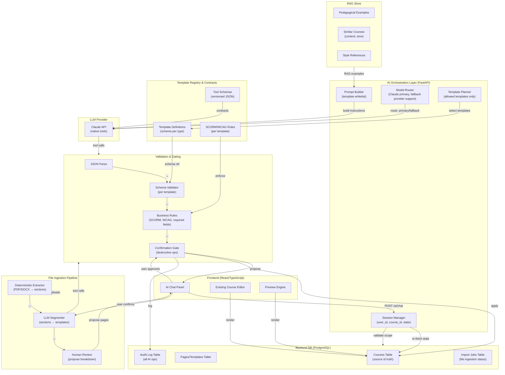
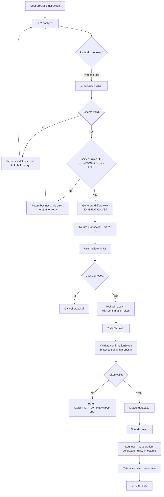
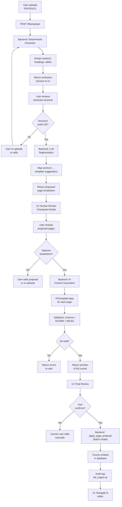

# Production-Ready AI Authoring Architecture

**Date:** 2026-06-13  
**Status:** Production Architecture Specification  
**Scope:** Comprehensive AI course generation system for LMS with safety, security, and phased rollout  
**Backend Stack:** Python/FastAPI + PostgreSQL (multi-tenant)  
**AI Model:** Claude (Anthropic API) with tool-calling and structured outputs  

---

## Table of Contents

1. [Executive Summary](#executive-summary)
2. [Architecture Overview](#architecture-overview)
3. [Tool/Function Contract Layer](#toolfunctions-layer)
4. [Session & State Management](#session--state-management)
5. [Change Validation & Gating Pipeline](#change-validation--gating-pipeline)
6. [File Ingestion Pipeline](#file-ingestion-pipeline)
7. [RAG vs. Tools Strategy](#rag-vs-tools-strategy)
8. [Security & Permissions](#security--permissions)
9. [Failure & Fallback Behavior](#failure--fallback-behavior)
10. [Implementation Roadmap (Phased)](#implementation-roadmap-phased)
11. [Testing & Regression Strategy](#testing--regression-strategy)
12. [System Prompt (Agent Instructions)](#system-prompt-agent-instructions)

---

## Executive Summary

This document defines a **production-grade AI course authoring system** that:

✅ **Preserves existing manual authoring** (no breaking changes)  
✅ **Adds AI as a parallel authoring path** via structured chat  
✅ **Ensures safety** via propose → validate → confirm → apply gating  
✅ **Enforces permissions** server-side (not prompt-based)  
✅ **Supports file ingestion** (PDF/DOCX → course outline)  
✅ **Rolls out in phases** with clear test criteria per chunk  
✅ **Maintains audit trail** (all AI operations logged)  
✅ **Keeps AI as a separate add-on layer** with minimal changes to existing backend/frontend implementation  

### In-Scope Templates (MVP)
- Text Content
- Tabs
- Accordion
- Click-to-Reveal
- Final Assessment

### Multi-Tenant Architecture
- One session per course UUID per user
- Permission scoped by organization + user role
- Tool calls validated server-side against session scope

---

## Architecture Overview

### 3.1 Component-Level Diagram



### 3.1.1 AI Layer Separation
The AI capability must be implemented as a separate integration layer on both backend and frontend. This separation is intentional: AI should be an add-on feature, not a refactor of the existing authoring platform.

- Backend AI code should be isolated in its own module/folder and exposed through new AI-specific routes.
- Frontend AI integration should be isolated in its own feature/module layer and consume those routes through a clean contract.
- Existing backend course/page routes, services, and database models should remain unchanged as much as possible.
- Existing frontend authoring UI components should be extended via integration hooks, not rewritten for AI.
- The goal is minimal codebase impact and maximal separation of concern.

Recommended backend structure:
- `app/ai/`
- `app/routers/ai_sessions.py`
- `app/routers/ai_tools.py`
- `app/services/ai/`
- `app/services/ai/ingestion.py`
- `app/services/ai/rag.py`
- `app/services/ai/validation.py`

Recommended frontend structure:
- `src/ai/`
- `src/api/ai/`
- `src/components/ai/`
- `src/stores/ai/` or equivalent session state module

Implementation contract:
- Backend exposes AI session lifecycle and tool endpoints.
- Frontend calls those endpoints, renders proposals and confirmations, and handles user approval.
- Existing manual authoring remains unchanged and continues to work in parallel.

Current repo alignment:
- The architecture docs already describe the AI session/tool APIs.
- The codebase currently does not contain `app/routers/ai_sessions.py` or `app/routers/ai_tools.py`.
- That is consistent with the architecture being an add-on layer: the current backend can remain intact while AI-specific routers are added separately.

### 3.2 Data Flow: Three Key Scenarios

#### Scenario A: Simple Chat Edit

```
1. User: "Simplify module 2 text to 8th grade level"
2. Frontend:
   - POST /api/v1/ai/chat { sessionId, courseId, userPrompt, mode: "refine" }
3. Backend Session Manager:
   - Verify user owns courseId
   - Re-fetch current course state from DB
   - Pass state to LLM
4. LLM (Claude):
   - Calls tools: fetch_page(pageId=2), update_page(patch proposal)
5. Validation & Gating:
   - Propose tool returns diff (no mutation)
   - Validation layer: schema + WCAG + pedagogy rules
   - Confirm gate: show diff to user
6. User approves in UI
7. Apply tool: actually update page in DB
8. Audit log: { user_id, op: "refine", before, after, timestamp }
9. Return updated course to UI, re-render
```

#### Scenario B: Full Course from Uploaded File

```
1. User uploads: course_outline.pdf
2. Frontend: POST /api/v1/files/upload { sessionId, courseId, file }
3. Backend File Ingestion:
   a. Deterministic extraction: PDF → sections, headings, tables
   b. LLM segmentation: sections → [ { title, suggestedTemplate, content } ]
   c. Checkpoint: return proposed page breakdown to UI
4. User reviews breakdown in modal, approves
5. Backend:
   a. AI Planner: fill template data for each proposed page
   b. Validation layer: schema + SCORM + WCAG per page
   c. Batch gating: show preview of all pages
6. User approves full course
7. Apply: create_page tool calls (multi-page, all-or-nothing)
8. Audit log: { user_id, op: "file_ingest", source_file, pages_created, timestamp }
9. Return fully populated course to UI
```

#### Scenario C: Destructive Delete Request

```
1. User: "Delete the assessment section"
2. LLM: calls delete_page(pageId, requiresConfirmation=true)
3. Validation Gate:
   - Destructive operation flagged
   - Separate confirmation tool: require_user_confirm(operation="delete", pageId)
4. UI: modal appears "Are you sure?"
5. User clicks "Delete"
6. Backend: delete_page(pageId, confirmationToken=<uuid>)
   - Validates confirmationToken matches pending operation
   - Delete from DB
7. Audit log: { user_id, op: "delete", pageId, confirmationToken, timestamp }
8. Return success, UI updates
```

---

## Tool/Function's Layer

### 4.1 Tool Definition Philosophy

All tools are:
- **Explicit JSON schemas** (versioned, version-controlled)
- **Auto-generated from OpenAPI spec** (no drift possible)
- **Scoped server-side** (not prompt-based)
- **Idempotent or stateless** (safe to retry)
- **Validated before execution** (schema + business rules)

### 4.2 Core Tool Schemas

#### Tool: `list_pages`
```json
{
  "name": "list_pages",
  "description": "Fetch all pages in the current course with metadata",
  "input_schema": {
    "type": "object",
    "properties": {},
    "required": []
  },
  "output_schema": {
    "type": "object",
    "properties": {
      "pages": {
        "type": "array",
        "items": {
          "type": "object",
          "properties": {
            "pageId": { "type": "string", "description": "UUID of the page" },
            "title": { "type": "string" },
            "templateType": {
              "type": "string",
              "enum": [
                "text-content",
                "tabs",
                "accordion",
                "click-reveal",
                "final-assessment"
              ]
            },
            "order": { "type": "integer" },
            "lastModified": { "type": "string", "format": "date-time" }
          }
        }
      }
    },
    "required": ["pages"]
  },
  "idempotent": true,
  "permissionScope": "current_session_courseId",
  "notes": "Re-fetch before any edit to ensure you have current state"
}
```

#### Tool: `fetch_page`
```json
{
  "name": "fetch_page",
  "description": "Fetch a single page with full component data",
  "input_schema": {
    "type": "object",
    "properties": {
      "pageId": {
        "type": "string",
        "description": "UUID of the page to fetch"
      }
    },
    "required": ["pageId"]
  },
  "output_schema": {
    "type": "object",
    "properties": {
      "pageId": { "type": "string" },
      "title": { "type": "string" },
      "templateType": {
        "type": "string",
        "enum": [
          "text-content",
          "tabs",
          "accordion",
          "click-reveal",
          "final-assessment"
        ]
      },
      "data": { "type": "object", "description": "Template-specific data" },
      "lastModified": { "type": "string", "format": "date-time" }
    },
    "required": ["pageId", "title", "templateType", "data"]
  },
  "idempotent": true,
  "permissionScope": "current_session_courseId",
  "notes": "ALWAYS fetch before proposing edits to a page"
}
```

#### Tool: `propose_create_page`
```json
{
  "name": "propose_create_page",
  "description": "Propose a new page (returns diff only, no mutation)",
  "input_schema": {
    "type": "object",
    "properties": {
      "title": {
        "type": "string",
        "maxLength": 200
      },
      "templateType": {
        "type": "string",
        "enum": [
          "text-content",
          "tabs",
          "accordion",
          "click-reveal",
          "final-assessment"
        ]
      },
      "data": {
        "type": "object",
        "description": "Template-specific data (validated against schema)"
      },
      "insertAtIndex": {
        "type": "integer",
        "description": "0-based position; omit to append at end"
      }
    },
    "required": ["title", "templateType", "data"]
  },
  "output_schema": {
    "type": "object",
    "properties": {
      "proposalId": {
        "type": "string",
        "description": "UUID of this proposal (used for apply confirmation)"
      },
      "previewPage": {
        "type": "object",
        "properties": {
          "pageId": { "type": "string" },
          "title": { "type": "string" },
          "templateType": { "type": "string" },
          "data": { "type": "object" }
        }
      },
      "validationStatus": {
        "type": "string",
        "enum": ["valid", "warning", "error"]
      },
      "validationMessages": {
        "type": "array",
        "items": {
          "type": "object",
          "properties": {
            "severity": { "type": "string", "enum": ["error", "warning", "info"] },
            "field": { "type": "string" },
            "message": { "type": "string" }
          }
        }
      }
    },
    "required": ["proposalId", "previewPage", "validationStatus"]
  },
  "idempotent": false,
  "permissionScope": "current_session_courseId",
  "notes": "This tool does NOT create the page; it returns a proposal. Use apply_page_proposal to actually create."
}
```

#### Tool: `apply_page_proposal`
```json
{
  "name": "apply_page_proposal",
  "description": "Apply a proposed page creation (requires prior proposal call)",
  "input_schema": {
    "type": "object",
    "properties": {
      "proposalId": {
        "type": "string",
        "description": "UUID returned from propose_create_page"
      },
      "userConfirmed": {
        "type": "boolean",
        "description": "Set to true only after user approval in UI"
      }
    },
    "required": ["proposalId", "userConfirmed"]
  },
  "output_schema": {
    "type": "object",
    "properties": {
      "pageId": { "type": "string" },
      "status": { "type": "string", "enum": ["created", "rejected", "error"] },
      "message": { "type": "string" }
    },
    "required": ["pageId", "status"]
  },
  "idempotent": true,
  "permissionScope": "current_session_courseId",
  "notes": "Idempotent: same proposalId + userConfirmed=true always creates the same page. Server checks timestamp + tokens to prevent double-apply."
}
```

#### Tool: `propose_update_page`
```json
{
  "name": "propose_update_page",
  "description": "Propose changes to an existing page (returns diff only, no mutation)",
  "input_schema": {
    "type": "object",
    "properties": {
      "pageId": {
        "type": "string",
        "description": "UUID of the page to modify"
      },
      "patch": {
        "type": "object",
        "description": "Partial update (only fields you want to change)",
        "properties": {
          "title": { "type": "string" },
          "data": { "type": "object" }
        }
      }
    },
    "required": ["pageId", "patch"]
  },
  "output_schema": {
    "type": "object",
    "properties": {
      "proposalId": { "type": "string" },
      "diff": {
        "type": "object",
        "properties": {
          "before": { "type": "object" },
          "after": { "type": "object" },
          "changedFields": { "type": "array", "items": { "type": "string" } }
        }
      },
      "validationStatus": { "type": "string" },
      "validationMessages": { "type": "array" }
    },
    "required": ["proposalId", "diff", "validationStatus"]
  },
  "idempotent": false,
  "permissionScope": "current_session_courseId",
  "notes": "Patch scope is validated: ensures you're not modifying out-of-scope pages"
}
```

#### Tool: `apply_update_proposal`
```json
{
  "name": "apply_update_proposal",
  "description": "Apply proposed page update",
  "input_schema": {
    "type": "object",
    "properties": {
      "proposalId": { "type": "string" },
      "userConfirmed": { "type": "boolean" }
    },
    "required": ["proposalId", "userConfirmed"]
  },
  "output_schema": {
    "type": "object",
    "properties": {
      "pageId": { "type": "string" },
      "status": { "type": "string" },
      "message": { "type": "string" }
    }
  },
  "idempotent": true,
  "permissionScope": "current_session_courseId"
}
```

#### Tool: `propose_delete_page`
```json
{
  "name": "propose_delete_page",
  "description": "Propose page deletion (requires explicit user confirmation due to destructiveness)",
  "input_schema": {
    "type": "object",
    "properties": {
      "pageId": { "type": "string" }
    },
    "required": ["pageId"]
  },
  "output_schema": {
    "type": "object",
    "properties": {
      "proposalId": { "type": "string" },
      "pagePreview": {
        "type": "object",
        "properties": {
          "pageId": { "type": "string" },
          "title": { "type": "string" },
          "templateType": { "type": "string" }
        }
      },
      "confirmationRequired": { "type": "boolean" }
    },
    "required": ["proposalId", "pagePreview", "confirmationRequired"]
  },
  "idempotent": false,
  "permissionScope": "current_session_courseId",
  "notes": "Destructive op. UI must show confirmation modal."
}
```

#### Tool: `confirm_delete_page`
```json
{
  "name": "confirm_delete_page",
  "description": "Confirm destructive delete after user approval",
  "input_schema": {
    "type": "object",
    "properties": {
      "proposalId": { "type": "string" },
      "userApprovedDelete": { "type": "boolean" }
    },
    "required": ["proposalId", "userApprovedDelete"]
  },
  "output_schema": {
    "type": "object",
    "properties": {
      "status": { "type": "string", "enum": ["deleted", "cancelled", "error"] },
      "message": { "type": "string" }
    }
  },
  "idempotent": false,
  "permissionScope": "current_session_courseId",
  "notes": "idempotent=false because delete is irreversible. Server stores confirmation token + timestamp to prevent accidental double-delete."
}
```

#### Tool: `query_similar_courses`
```json
{
  "name": "query_similar_courses",
  "description": "Query RAG store for similar course templates and style references",
  "input_schema": {
    "type": "object",
    "properties": {
      "query": {
        "type": "string",
        "description": "Pedagogical or content query (e.g., 'introductory calculus', 'compliance training tone')"
      },
      "limit": {
        "type": "integer",
        "minimum": 1,
        "maximum": 5,
        "default": 3
      }
    },
    "required": ["query"]
  },
  "output_schema": {
    "type": "object",
    "properties": {
      "results": {
        "type": "array",
        "items": {
          "type": "object",
          "properties": {
            "courseTitle": { "type": "string" },
            "relevanceScore": { "type": "number", "minimum": 0, "maximum": 1 },
            "examplePages": {
              "type": "array",
              "items": {
                "type": "object",
                "properties": {
                  "pageTitle": { "type": "string" },
                  "templateType": { "type": "string" },
                  "excerpt": { "type": "string" }
                }
              }
            },
            "toneNotes": { "type": "string" }
          }
        }
      }
    }
  },
  "idempotent": true,
  "permissionScope": "org_level (no course scope needed)",
  "notes": "RAG results for EXAMPLES ONLY. Never use RAG for API contracts or validation rules."
}
```

### 4.3 Error Response Contract

All tools return errors in consistent shape:

```json
{
  "status": "error",
  "code": "VALIDATION_ERROR|PERMISSION_DENIED|NOT_FOUND|TIMEOUT|SERVER_ERROR",
  "message": "Human-readable error message",
  "details": {
    "field": "fieldName",
    "reason": "specific validation failure"
  },
  "retryable": true|false
}
```

Example validation error:
```json
{
  "status": "error",
  "code": "VALIDATION_ERROR",
  "message": "Page title exceeds max length (200 chars)",
  "details": {
    "field": "title",
    "reason": "max_length_exceeded",
    "max": 200,
    "actual": 235
  },
  "retryable": true
}
```

---

## Session & State Management

### 5.1 Session Lifecycle

#### Session Creation
```
POST /ai/sessions
Body: { userId, courseId, organizationId }
Response: 
{
  "sessionId": "uuid",
  "courseId": "uuid",
  "userId": "uuid",
  "organizationId": "uuid",
  "createdAt": "ISO-8601",
  "expiresAt": "ISO-8601 (24h default)",
  "state": { /* current course state */ }
}
```

#### Session Rules
1. **Scope is single course** per session (no multi-course in one session)
2. **Scope is immutable** (cannot change courseId within a session)
3. **Re-fetch state before each edit** (do not rely on prior turns)
4. **Database is source of truth**, not conversation history
5. **Session expires after 24 hours** or on logout (configurable)

### 5.1.1 Frontend Session Contract
Frontend must implement a strict session flow:
- POST `/api/v1/ai/sessions` with `userId`, `courseId`, and `organizationId`.
- Store `sessionId` securely in localStorage or session storage while AI mode is active.
- Attach `Authorization: Session {sessionId}` to all subsequent AI tool calls.
- On page reload, refresh session context by calling `GET /api/v1/ai/sessions/{sessionId}`.
- If the session has expired, redirect users to restart AI mode instead of reusing stale state.
- Before any edit, frontend should call `list_pages` or `fetch_page` to load current page state and avoid relying on cached conversation context.
- For destructive or batch operations, render an explicit confirmation modal before invoking `apply_*` or `confirm_delete_page`.

### 5.2 State Management Rules (Critical)

**Rule 1: DB = Source of Truth**
```
// BAD (relies on prior conversation turn):
User: "Delete the quiz page"
AI remembers "quiz page is ID 42" from turn 2
→ Calls delete_page(pageId: 42)
→ PROBLEM: page might have been deleted/moved by another user

// GOOD:
User: "Delete the quiz page"
AI: Calls list_pages() to get current state
   Finds quiz page → pageId: 42
   Calls propose_delete_page(pageId: 42)
   Calls confirm_delete_page(proposalId: ..., userApprovedDelete: true)
```

**Rule 2: Re-fetch Before Edit**
Every edit operation MUST follow this flow:
```
1. fetch_page(pageId)  // Get current state from DB
2. propose_* (pageId, updates)  // Return diff only
3. User approves in UI
4. apply_* (proposalId)  // Mutate DB only after approval
```

**Rule 3: Conversation Context Truncation**
If conversation context truncates mid-session:
```
1. Session state is persisted server-side (not in conversation)
2. New context: AI is re-initialized with same sessionId
3. AI has no memory of prior turns
4. Re-fetch all state via tool calls
5. No data loss because DB = source of truth
```

### 5.3 Permission Scoping (Server-Side Enforcement)

Every tool call validates:
```
// Tool execution pseudocode:
execute_tool(toolName, sessionId, input):
  session = fetch_session(sessionId)
  if session.expired or session.user_id != current_user:
    return error(PERMISSION_DENIED)
  
  if toolName in ["list_pages", "fetch_page", "propose_*", "apply_*", "confirm_*"]:
    // Validate that pageId belongs to session.courseId
    page = fetch_page_from_db(input.pageId)
    if page.courseId != session.courseId:
      return error(PERMISSION_DENIED)
  
  // Execute the tool
  return execute(toolName, input)
```

---

## Change Validation & Gating Pipeline

### 6.1 Propose → Validate → Confirm → Apply Flow



### 6.2 Validation Pipeline Details

#### Step 1: JSON Parse Validation
```
validate_json_parse(input):
  try:
    parsed = json.loads(input)
    return { status: "valid", parsed }
  except JSONDecodeError as e:
    return { 
      status: "error", 
      code: "JSON_PARSE_ERROR",
      message: f"Invalid JSON at line {e.lineno}: {e.msg}",
      retryable: true 
    }
```

#### Step 2: Schema Validation
```
validate_schema(templateType, data):
  schema = TemplateRegistry.get_schema(templateType)
  if not schema:
    return { status: "error", code: "UNKNOWN_TEMPLATE", retryable: false }
  
  try:
    jsonschema.validate(data, schema)
    return { status: "valid" }
  except jsonschema.ValidationError as e:
    return {
      status: "error",
      code: "SCHEMA_VALIDATION_ERROR",
      field: e.path,
      message: e.message,
      retryable: true
    }
```

#### Step 3: Business Rules Validation
```
validate_business_rules(templateType, data, courseContext):
  errors = []
  
  // SCORM compliance
  if data.scoring and data.scoring.maxScore > 100:
    errors.append({ severity: "error", field: "scoring.maxScore", 
                    message: "SCORM limit: max 100 points" })
  
  // WCAG accessibility
  if templateType == "final-assessment":
    if not data.assessmentMetadata.hasAccessibleInstructions:
      errors.append({ severity: "warning", field: "accessibleInstructions",
                      message: "Assessment should have accessible instructions" })
  
  // Required fields per template
  for field in TemplateRegistry.required_fields(templateType):
    if field not in data:
      errors.append({ severity: "error", field, 
                      message: f"Required field '{field}' missing" })
  
  // Final Assessment specific
  if templateType == "final-assessment":
    if len(data.questions) < 3:
      errors.append({ severity: "error", field: "questions",
                      message: "Assessment must have at least 3 questions" })
    for q in data.questions:
      if not q.hasCorrectAnswer:
        errors.append({ severity: "error", field: "question.correctAnswer",
                        message: "Question must have marked correct answer" })
  
  return errors
```

#### Step 4: Confirmation Gate (for Destructive Ops)
```
require_confirmation_for_destructive(operation):
  if operation in ["delete_page", "bulk_replace_pages", "clear_course"]:
    return true
  return false

// In apply_* for destructive ops:
if require_confirmation_for_destructive(operation):
  if not confirmationToken or not validate_token(confirmationToken):
    return { status: "error", code: "CONFIRMATION_REQUIRED" }
```

### 6.3 Batch Operation Semantics (Multi-Page)

For file ingestion or multi-page operations:
- **Strategy: All-or-nothing per batch**
  - If any page fails validation, entire batch rejected
  - UI shows which page(s) have errors
  - User can fix and re-submit
  - Either all pages created or none

Example:
```json
{
  "batchId": "uuid",
  "operation": "create_pages_from_file",
  "pages": [
    { "title": "Page 1", "templateType": "text-content", "data": {...} },
    { "title": "Page 2", "templateType": "tabs", "data": {...} }
  ]
}

// Validation returns:
{
  "batchId": "uuid",
  "status": "error",
  "failureMode": "all-or-nothing",
  "errors": [
    { "pageIndex": 1, "field": "data.items", "message": "Tabs requires at least 2 items" }
  ],
  "nextAction": "User must fix page 2 and resubmit"
}
```

---

## File Ingestion Pipeline

### 7.1 Workflow: Upload → Parse → Segment → Review → Create



### 7.1.1 Frontend File Ingestion Contract
Frontend should implement an upload review flow consistent with backend file ingestion:
- Upload file metadata and `session_id` to `/api/v1/files/upload`.
- Render the extraction preview with sections, headings, and tables.
- Allow users to merge, split, reorder, and retitle proposed pages before approval.
- Submit approved `proposedPages` back to the backend for content generation.
- Display validation issues and page-level schema errors before the user confirms the final apply.
- Only call backend batch create/apply APIs after explicit user approval of the proposed course structure.

### 7.1.2 Frontend → Backend API Contract
Use a dedicated AI integration contract for all session and tool workflows.

#### Session Management
- `POST /api/v1/ai/sessions`
  - Request body:
    ```json
    {
      "userId": "string",
      "courseId": "string",
      "organizationId": "string",
      "mode": "authoring"  // optional, defaults to ai-mode
    }
    ```
  - Response body:
    ```json
    {
      "sessionId": "string",
      "userId": "string",
      "courseId": "string",
      "organizationId": "string",
      "createdAt": "string",
      "expiresAt": "string",
      "state": { /* current course/session metadata */ }
    }
    ```

- `GET /api/v1/ai/sessions/{sessionId}`
  - Response: same shape as session creation response.

- `DELETE /api/v1/ai/sessions/{sessionId}`
  - Response: `{ "deleted": true, "sessionId": "string" }`

#### Tool Calls
- `POST /api/v1/ai/tools/{toolName}`
  - Headers:
    - `Authorization: Session {sessionId}`
  - Request body:
    ```json
    {
      "sessionId": "string",
      "input": { /* tool-specific payload */ }
    }
    ```
  - Common tool endpoints:
    - `/api/v1/ai/tools/list_pages`
    - `/api/v1/ai/tools/fetch_page`
    - `/api/v1/ai/tools/propose_create_page`
    - `/api/v1/ai/tools/apply_page_proposal`
    - `/api/v1/ai/tools/propose_update_page`
    - `/api/v1/ai/tools/query_similar_courses`

- Example `propose_create_page` payload:
    ```json
    {
      "sessionId": "string",
      "input": {
        "courseId": "string",
        "title": "Introduction to Data Science",
        "templateType": "text-content",
        "data": { /* template-specific data */ }
      }
    }
    ```

#### File Upload / Ingestion
- `POST /api/v1/files/upload`
  - Content type: `multipart/form-data`
  - Fields:
    - `file`: binary upload
    - `sessionId`: string
    - `courseId`: string
    - `description`: string (optional)
  - Example response:
    ```json
    {
      "uploadId": "string",
      "filename": "course_outline.pdf",
      "status": "uploaded",
      "previewUrl": "string"
    }
    ```

- `POST /api/v1/files/approve` or batch apply route (if implemented)
  - Request body:
    ```json
    {
      "sessionId": "string",
      "uploadId": "string",
      "proposedPages": [ /* approved page definitions */ ]
    }
    ```

### 7.1.3 Frontend vs Backend Responsibilities
This section makes the boundary explicit so the frontend team can implement UI and integration without backend internal changes.

#### Frontend responsibilities
- Create and manage AI sessions in the browser.
- Persist `sessionId` securely while AI authoring is active.
- Call backend AI session routes and tool endpoints with the proper session header.
- Render current course/page state before issuing any edit.
- Present proposed changes, diff previews, and validation errors to users.
- Require explicit approval before sending `apply_*` or file ingestion commit requests.
- Provide an upload review workflow for file ingestion: preview sections, edit page structure, and confirm proposals.
- Handle session expiration and user-facing retry flows.

#### Backend responsibilities
- Expose session lifecycle endpoints and determine session validity/expiry.
- Enforce permissions by validating `sessionId`, `userId`, and `courseId` against DB state.
- Treat the database as the source of truth for every operation.
- Execute tool actions only after validation and explicit approval.
- Validate all proposed page changes against schema, SCORM, accessibility, and pedagogy rules.
- Log all AI authoring operations for audit and rollback.
- Manage backend file uploads and ingestion job state.
- Provide deterministic extraction and AI-assisted content generation services.

### 7.1.4 Architecture Note: AI Layer Separation
The AI capability must be implemented as a separate integration layer on both backend and frontend.
- Backend AI code should live in its own module/folder and expose clean AI session/tool APIs.
- Frontend AI integration should live in its own UI/module layer and consume those APIs without embedding AI orchestration into the core app.
- Existing course, page, and validation services should be reused, not rewritten for AI.
- The goal is minimal change to current implementation while enabling the AI feature as an add-on.

### 7.2 Step 1: Deterministic Extraction (PDF/DOCX → Sections)

**Technology:** Python libraries: `pdfplumber` (PDF), `python-docx` (DOCX)

```python
def extract_document_structure(file_path: str) -> ExtractionResult:
    """
    Extract document structure deterministically.
    Returns: List of sections with headings, text, tables.
    """
    
    if file_path.endswith(".pdf"):
        sections = extract_pdf_sections(file_path)
    elif file_path.endswith(".docx"):
        sections = extract_docx_sections(file_path)
    else:
        raise UnsupportedFileFormat()
    
    return ExtractionResult(
        filename=Path(file_path).name,
        totalSections=len(sections),
        sections=[
            {
                "index": i,
                "heading": s.heading,
                "headingLevel": s.level,  # H1, H2, H3
                "textContent": s.text,
                "tables": s.tables,
                "images": s.images,
            }
            for i, s in enumerate(sections)
        ]
    )

# Example output:
{
  "filename": "course_outline.pdf",
  "totalSections": 5,
  "sections": [
    {
      "index": 0,
      "heading": "Module 1: Introduction",
      "headingLevel": 1,
      "textContent": "Learn the basics of...",
      "tables": [],
      "images": ["image_1.png"]
    },
    {
      "index": 1,
      "heading": "1.1 Core Concepts",
      "headingLevel": 2,
      "textContent": "The key idea is...",
      "tables": [{"rows": [...], "cols": [...]}],
      "images": []
    }
    // ... more sections
  ]
}
```

### 7.3 Step 2: LLM Segmentation (Sections → Template Suggestions)

**Prompt:** Map extracted sections to allowed templates

```python
def segment_and_suggest_templates(extraction: ExtractionResult) -> SegmentationResult:
    """
    Use LLM to suggest template type for each extracted section.
    Output: List of proposed pages with template suggestions.
    """
    
    prompt = f"""
You are a course design expert. Given an extracted document structure, 
suggest how to organize it into course pages.

Allowed templates:
- text-content: Static text, paragraphs, key points
- tabs: Compare/group subtopics (2–6 items)
- accordion: Expandable Q&A, procedures, details
- click-reveal: Interaction-based concept reveal
- final-assessment: Quiz/assessment questions

Extracted document:
{json.dumps(extraction.sections, indent=2)}

Return ONLY valid JSON:
{{
  "proposedPages": [
    {{
      "pageTitle": "string",
      "suggestedTemplate": "text-content|tabs|accordion|click-reveal|final-assessment",
      "sourceIndices": [0, 1],  // section indices that map to this page
      "rationale": "why this template"
    }},
    // ... more pages
  ]
}}
"""
    
    response = claude.messages.create(
        model="claude-3-5-sonnet-20241022",
        max_tokens=2000,
        messages=[{"role": "user", "content": prompt}]
    )
    
    return parse_segmentation_response(response)
```

Example output:
```json
{
  "proposedPages": [
    {
      "pageTitle": "Module 1: Introduction",
      "suggestedTemplate": "text-content",
      "sourceIndices": [0],
      "rationale": "Introductory overview with static content"
    },
    {
      "pageTitle": "Core Concepts Comparison",
      "suggestedTemplate": "tabs",
      "sourceIndices": [1, 2],
      "rationale": "Three key concepts that benefit from side-by-side tabs"
    },
    {
      "pageTitle": "FAQs & Common Questions",
      "suggestedTemplate": "accordion",
      "sourceIndices": [3],
      "rationale": "Q&A format perfect for expandable accordion"
    },
    {
      "pageTitle": "Final Quiz",
      "suggestedTemplate": "final-assessment",
      "sourceIndices": [4],
      "rationale": "End-of-module assessment"
    }
  ]
}
```

### 7.4 Step 3: Human Review Checkpoint

**UI Modal:**
```
Title: "Review Proposed Page Breakdown"
Subtitle: "Course will be created with the following pages. Adjust if needed."

[Table]
| # | Page Title | Template | Source Sections | Actions |
|---|------------|----------|-----------------|---------|
| 1 | Module 1: Introduction | text-content | Section 0 | Edit |
| 2 | Core Concepts | tabs | Sections 1–2 | Edit |
| 3 | FAQs | accordion | Section 3 | Edit / Delete |
| 4 | Final Quiz | final-assessment | Section 4 | Edit |

[Cancel] [Approve & Continue]
```

Users can:
- Merge pages ("combine pages 2 and 3")
- Split pages ("page 1 is too long")
- Reorder pages (drag-and-drop)
- Change template type
- Edit page title

Once approved → proceed to Step 4.

### 7.5 Step 4: Content Generation & Validation

```python
async def generate_course_from_file(
    jobId: str,
    courseId: str,
    proposedPages: list[ProposedPage],
    extraction: ExtractionResult
) -> CourseGenerationResult:
    """
    For each proposed page, generate full template data via LLM.
    Validate against schema + business rules.
    Return course ready for apply.
    """
    
    results = []
    for page in proposedPages:
        source_text = " ".join([
            extraction.sections[i].textContent
            for i in page.sourceIndices
        ])
        
        # Generate template data
        template_data = await generate_template_data(
            templateType=page.suggestedTemplate,
            title=page.pageTitle,
            sourceText=source_text
        )
        
        # Validate
        validation = validate_template_data(
            templateType=page.suggestedTemplate,
            data=template_data
        )
        
        if validation.status == "error":
            return CourseGenerationResult(
                status="validation_failed",
                failedPage=page,
                validationErrors=validation.errors
            )
        
        results.append({
            "title": page.pageTitle,
            "templateType": page.suggestedTemplate,
            "data": template_data
        })
    
    return CourseGenerationResult(
        status="ready_for_apply",
        courseId=courseId,
        pages=results
    )
```

### 7.6 Error Handling: Malformed/Scanned Documents

```python
def validate_extraction(extraction: ExtractionResult) -> ExtractionValidation:
    """
    Check if extracted structure is usable.
    """
    issues = []
    
    # Scanned document detection
    if len([s for s in extraction.sections if len(s.textContent) < 10]) > 0.5 * len(extraction.sections):
        issues.append({
            "severity": "error",
            "message": "Document appears to be scanned/image-only. OCR required.",
            "action": "Suggest OCR tool or re-upload as text-based PDF"
        })
    
    # Very short content
    total_chars = sum(len(s.textContent) for s in extraction.sections)
    if total_chars < 100:
        issues.append({
            "severity": "warning",
            "message": "Document is very short; may not have enough content for a course",
            "action": "User can proceed or re-upload"
        })
    
    # Too many sections
    if len(extraction.sections) > 50:
        issues.append({
            "severity": "warning",
            "message": "Document has many sections; course may be very long",
            "action": "User can merge sections or proceed"
        })
    
    return ExtractionValidation(
        isValid=len([i for i in issues if i["severity"] == "error"]) == 0,
        issues=issues
    )
```

---

## RAG vs. Tools Strategy

### 8.1 RAG: What and What NOT

**RAG IS USED FOR:**
1. **Pedagogical examples** ("How do other courses teach X topic?")
2. **Similar course content** (past courses with related learning objectives)
3. **Style/tone references** (how do similar courses address tone?)
4. **Best practices** (accessibility patterns, assessment design)

**RAG IS NOT USED FOR:**
1. ❌ API contracts (tool schemas, endpoint definitions)
2. ❌ Validation rules (business rules, required fields)
3. ❌ Template definitions (JSON schema per template)
4. ❌ System constants (enums, allowlists)

**Why the boundary?**
- API contracts must be version-controlled, not emergent from similarity search
- If RAG retrieves old/stale API contracts, the AI will generate invalid tool calls
- Tools/schemas are first-class, not documents

### 8.2 RAG Indexing Strategy

**Indexed Content:**
```
For each existing course:
- Metadata: courseId, title, learningObjectives, targetAudience
- Page summaries: pageTitle, templateType, contentExcerpt
- Quality scores: accessibility_score, engagement_score, completion_rate
- Tags: topic, difficulty_level, compliance_framework
```

**Indexing Refresh:**
- **On course creation**: index new course (24-hour delay acceptable)
- **On course modification**: re-index that course
- **On course deletion**: remove from index
- **Quarterly full reindex**: rebuild index from all active courses

**RAG Query Flow:**
```
User instruction: "Create an intro module on data science"
→ LLM: Calls query_similar_courses("intro module data science")
→ RAG: Returns [ course_1, course_2, course_3 ]
  with relevanceScores, examplePages, toneNotes
→ LLM: Incorporates examples into content generation prompts
→ Generate pages with informed tone/structure
```

### 8.2.1 Stale RAG Handling & Fallback
- If `query_similar_courses` returns no results, the agent must continue with tool-driven generation and not treat it as a fatal error.
- If RAG returns examples that conflict with current tool schema or session scope, ignore them and revalidate against the live tool contract.
- RAG is advisory only: results should be used for tone, pedagogy, and structure inspiration, not as authority for schema or validation.
- Refresh the RAG index on course creation and modification, remove deleted courses immediately, and rebuild the full index quarterly.

### 8.3 Tool Schemas: Version Control & Generation

**Source of Truth:**
- OpenAPI 3.1 spec in git (`backend/openapi-v3.1-complete.yaml`)
- Tool schemas auto-generated from OpenAPI spec
- No manual JSON schema drift possible

**Generation Pipeline:**
```python
def generate_tool_schemas_from_openapi(spec_path: str) -> dict:
    """
    Parse OpenAPI spec and generate Claude tool definitions.
    Output: File uploaded to Claude via API.
    """
    spec = yaml.load(open(spec_path))
    
    tools = []
    for path, pathItem in spec["paths"].items():
        for method, operation in pathItem.items():
            tool = {
                "name": operation["operationId"],
                "description": operation["summary"],
                "input_schema": operation["requestBody"]["content"]["application/json"]["schema"],
                "output_schema": operation["responses"]["200"]["content"]["application/json"]["schema"],
            }
            tools.append(tool)
    
    return tools
```

**Tool Schema Versioning:**
- Every OpenAPI spec change → regenerate tool schemas
- Version number in system prompt: "Tools v2.3.1 (2026-06-13)"
- If LLM seems confused: swap version of tool definitions

---

## Security & Permissions

### 9.1 Tool Execution Scope Enforcement

**Server-Side Validation (Every Tool Call):**

```python
class ToolExecutor:
    def execute(self, sessionId: str, toolName: str, input: dict) -> dict:
        # 1. Validate session exists and is active
        session = self.session_store.get(sessionId)
        if not session or session.is_expired():
            raise PermissionError("Session invalid or expired")
        
        # 2. Verify user ownership
        if session.user_id != get_current_user_id():
            raise PermissionError("Session user mismatch")
        
        # 3. For course-scoped tools, validate pageId/courseId scope
        if toolName in ["fetch_page", "propose_update_page", "propose_delete_page"]:
            pageId = input.get("pageId")
            page = self.db.fetch_page(pageId)
            
            if page.course_id != session.course_id:
                raise PermissionError(
                    f"Page {pageId} does not belong to course {session.course_id}"
                )
        
        # 4. Rate limit check
        call_count = self.rate_limiter.get_call_count(
            user_id=session.user_id,
            window="1_hour"
        )
        if call_count > 100:
            raise RateLimitError("Max 100 tool calls per hour exceeded")
        
        # 5. Execute the tool
        result = self._execute_tool(toolName, input)
        
        # 6. Audit log
        self.audit_log.write({
            "timestamp": datetime.utcnow(),
            "user_id": session.user_id,
            "session_id": sessionId,
            "tool_name": toolName,
            "input_hash": hash(json.dumps(input, sort_keys=True)),
            "result_status": result.get("status"),
        })
        
        return result
```

### 9.2 No Direct DB Access

**Prohibited Tools:**
```
❌ "execute_sql"
❌ "direct_db_query"
❌ "list_all_courses" (should scope to org)
❌ "fetch_user_data"
```

**All interactions go through domain-scoped tools** (list_pages, fetch_page, etc.)

### 9.3 Audit Logging

**Log Schema:**
```python
class AuditLogEntry:
    timestamp: datetime
    user_id: str
    organization_id: str
    session_id: str
    tool_name: str
    operation: str  # "create", "update", "delete"
    resource_id: str  # pageId, courseId
    before_state: dict  # Serialized before state
    after_state: dict  # Serialized after state
    diff: dict  # { "changed_fields": [...], "old_values": {...}, "new_values": {...} }
    result_status: str  # "success", "error"
    error_code: str | None
    ip_address: str
    user_agent: str
```

**Retention:**
- All logs retained for **2 years**
- Searchable by: user_id, courseId, tool_name, date range
- Export available to admins for compliance audits

### 9.4 Rate Limits & Cost Controls

**Per-User Limits:**
- 100 tool calls per hour
- 50 LLM API calls per day (file ingestion + refine iterations)
- 10 GB file upload quota per month

**Per-Organization Limits:**
- 1000 tool calls per day
- 500 LLM API calls per day
- Cost cap: \$500/month (optional; can disable for enterprise)

**Rate Limit Response:**
```json
{
  "status": "error",
  "code": "RATE_LIMIT_EXCEEDED",
  "message": "You have exceeded your tool call limit (100 per hour)",
  "retryAfter": 3600,
  "currentUsage": 103,
  "limit": 100
}
```

### 9.5 Secret Redaction in Logs

```python
def redact_sensitive_fields(obj: dict) -> dict:
    """Remove sensitive data before logging."""
    redacted = copy.deepcopy(obj)
    
    sensitive_paths = [
        "*.password",
        "*.apiKey",
        "*.token",
        "*.authorization",
        "data.studentEmails",  # PII
        "data.studentNames",
    ]
    
    for path in sensitive_paths:
        # Use JSONPath to find and redact
        redacted = redact_json_path(redacted, path, "[REDACTED]")
    
    return redacted
```

---

## Failure & Fallback Behavior

### 10.1 Per-Tool Failure Modes

#### Tool: Validation Error

```
When: Schema validation fails for page data
Example: "final-assessment is missing 3 questions (has 1)"

AI Action:
1. Receives validation_error response
2. Extracts error details from "validationMessages"
3. Calls same tool again with corrected data
4. Max 2 automatic retries per proposal
5. If still fails: return to user "Please fix: ..."

User sees (in chat): "Assessment needs at least 3 questions. Let me adjust..."
```

#### Tool: Timeout or Backend Unavailable

```
When: Backend is slow or down (>5s latency)

AI Action:
1. Receives timeout error after 30s
2. Does NOT retry automatically (could make things worse)
3. Informs user: "Backend is temporarily unavailable. Try again in 1 min."
4. Session remains valid; user can retry

User sees: "Connection timeout. Please try again."
```

#### Tool: Permission Denied

```
When: AI attempts to modify another course

AI Action:
1. Receives PERMISSION_DENIED error
2. Should NEVER happen (server enforces scope)
3. If it does: logs security incident
4. Informs user: "Access denied to this resource"
5. Does NOT retry

User sees: "Access denied. This shouldn't happen—contact support."
```

#### Tool: RAG Returns Nothing Relevant

```
When: query_similar_courses(query) returns empty results

AI Action:
1. Proceeds without examples (graceful degradation)
2. Generates content from task description alone
3. May note to user: "No similar courses found. Using general best practices."
4. Quality may be slightly lower but functional

User sees: (no impact; continues normally)
```

### 10.2 Model Fallback Strategy (Primary → Secondary)

**Configuration:**
```python
MODEL_CONFIG = {
    "primary": {
        "model": "claude-3-5-sonnet-20241022",
        "maxTokens": 4096,
    },
    "fallback": {
        "model": "claude-3-5-haiku-20241022",
        "maxTokens": 2048,
    }
}
```

**Routing Logic:**
```python
async def call_ai_model(prompt: str, mode: str) -> AIResponse:
    """
    Try primary model first. On failure, fallback to secondary.
    """
    try:
        response = await claude.messages.create(
            model=MODEL_CONFIG["primary"]["model"],
            max_tokens=MODEL_CONFIG["primary"]["maxTokens"],
            system=build_system_prompt(mode),
            messages=[{"role": "user", "content": prompt}]
        )
        return AIResponse(
            modelUsed="primary",
            content=response.content,
        )
    
    except (APITimeoutError, RateLimitError, APIConnectionError) as e:
        logger.warning(f"Primary model failed: {e}. Falling back to secondary.")
        
        try:
            response = await claude.messages.create(
                model=MODEL_CONFIG["fallback"]["model"],
                max_tokens=MODEL_CONFIG["fallback"]["maxTokens"],
                system=build_system_prompt(mode),
                messages=[{"role": "user", "content": prompt}]
            )
            return AIResponse(
                modelUsed="fallback",
                content=response.content,
                fallbackReason=str(e)
            )
        
        except Exception as e:
            logger.error(f"Both primary and fallback failed: {e}")
            raise AIServiceUnavailable("LLM service unavailable")
```

**User Experience:**
- Primary model: Best quality, higher latency
- Fallback model: Slightly lower quality, faster
- User sees: No difference (both generate valid output)
- Metadata returned so debugging is transparent

### 10.3 Partial Failure Recovery (Multi-Page Batch)

**Scenario: Creating 5 pages, page 3 fails validation**

```
Batch status before apply:
✅ Page 1: valid
✅ Page 2: valid
❌ Page 3: validation error
✅ Page 4: valid
✅ Page 5: valid

User sees modal:
"1 of 5 pages has an issue:
  Page 3 (Tabs template): Tab item missing 'title' field
  
  [Fix & Resubmit] [Proceed Without This Page] [Cancel]"

User action: "Fix & Resubmit"
→ Edit page 3 data
→ Resubmit batch
→ All-or-nothing re-validation
→ If all pass now: create all 5 pages
```

**Alternative: Proceed Without This Page**
```
AI removes page 3 from batch → creates pages 1, 2, 4, 5 only
Audit log notes: "Batch creation: 4 of 5 pages created (1 skipped per user request)"
User can manually add page 3 later or ask AI to retry just that page
```

---

## Implementation Roadmap (Phased)

### 11.1 Chunk Structure: Safety-First Phasing

Based on attached docs' 8-chunk plan, enhanced with production requirements:

| Chunk | Focus | Duration | Exit Criteria |
|-------|-------|----------|---------------|
| **Chunk 0** | Foundation & Feature Flag | 0.5 days | Feature flag hides all AI UI when off; manual flow unchanged |
| **Chunk 1** | Tool Contracts & Registry | 1 day | Tool schemas versioned; registry complete; 5 templates defined |
| **Chunk 2** | Session & State Management | 1 day | Session lifecycle working; re-fetch rule enforced; permission scoping server-side |
| **Chunk 3** | Validation Pipeline | 1 day | Propose → validate → confirm → apply gating complete; error responses consistent |
| **Chunk 4** | File Ingestion Pipeline | 1.5 days | Extract → segment → checkpoint → apply flow end-to-end; malformed doc handling |
| **Chunk 5** | AI Prompt & Model Router | 1 day | Prompt builder with whitelist; model routing (primary/fallback) working |
| **Chunk 6** | Course Assembly | 1 day | AI output → existing editor state mapping; preview + export unchanged |
| **Chunk 7** | Chat UI Panel | 0.5 days | Chat panel + status states + error messages; session management UI |
| **Chunk 8** | Refine Mode & Patches | 1 day | Refine mode tool calls; patch validator; scoped updates working |
| **Chunk 9** | Audit & Security Hardening | 1 day | Audit logging complete; rate limits enforced; secret redaction working |
| **Chunk 10** | Regression & Demo Readiness | 1 day | All regression tests pass; manual flow intact; demo scripts ready |
| **Total** | | ~10–11 days | Production-ready |

### 11.2 Template-Wise Delivery (Alternative Path)

If you want to deliver visible value sooner:

| Template | Chunk | Build | Status |
|----------|-------|-------|--------|
| **T0: Shared Core** | 0–2 | Registry, schemas, validator | Must complete first |
| **T1: Text Content** | 3 | Planner + content generator for text | Simplest; do first |
| **T2: Tabs** | 4 | Item count rules + tab mapping | Medium complexity |
| **T3: Accordion** | 5 | Expand/collapse + ordering | Medium complexity |
| **T4: Click-to-Reveal** | 6 | Interaction content constraints | Medium complexity |
| **T5: Final Assessment** | 7–8 | Question rules + scoring validation | Most complex; do last |

**Delivery**: T0 → T1 → T2 → T3 → T4 → T5 (one template per 1–2 days)

### 11.3 Checkpoint & Sign-Off Per Chunk

**Chunk Sign-Off Checklist:**
```
□ Build tasks 100% complete
□ All chunk test cases pass (see Section 12)
□ No regression in manual authoring flow
□ Code reviewed and merged
□ Deployed to staging
□ Product owner sign-off before moving to next chunk
```

**Go/No-Go for Production Release:**
```
✅ All chunks 0–10 complete and signed off
✅ Manual course creation works identically to baseline
✅ AI create flow: prompt → draft → preview → export succeeds
✅ AI refine flow: edit → patch preview → apply succeeds
✅ File ingestion: upload → parse → segment → create succeeds
✅ Fallback model works when primary fails
✅ Audit logs complete + searchable
✅ Rate limits enforced
✅ Security review passed
✅ Load test: 100 concurrent AI sessions stable
✅ Demo script validated with stakeholders
```

---

## Testing & Regression Strategy

### 12.1 Per-Chunk Test Cases

#### Chunk 0: Feature Flag

- **TC-CH0-01**: Feature flag off → no AI button visible
  - Expected: Editor UI identical to baseline
- **TC-CH0-02**: Feature flag on → AI entry button visible
  - Expected: Manual flow unchanged; AI panel closed by default
- **TC-CH0-03**: Missing model env config → friendly error
  - Expected: App doesn't crash; user sees "AI not configured"

#### Chunk 1: Tool Contracts & Registry

- **TC-CH1-01**: list_pages() call → returns all pages with metadata
  - Expected: Format matches schema, order preserved
- **TC-CH1-02**: fetch_page(validPageId) → returns full page data
  - Expected: All fields populated per template schema
- **TC-CH1-03**: fetch_page(invalidPageId) → 404 error
  - Expected: Error response has correct shape
- **TC-CH1-04**: propose_create_page(valid text-content) → proposalId returned
  - Expected: Validation passes; no page created yet
- **TC-CH1-05**: propose_create_page(invalid tabs: 1 item) → validation error
  - Expected: Error lists "tabs requires 2+ items"
- **TC-CH1-06**: query_similar_courses("calculus") → RAG results returned
  - Expected: Results include courseTitle, relevanceScore, examplePages

#### Chunk 2: Session & State Management

- **TC-CH2-01**: Create session → sessionId returned with expiry
  - Expected: expiry = now + 24h
- **TC-CH2-02**: Re-fetch page state after another user edits → sees new state
  - Expected: fetch_page returns latest DB state, not cached
- **TC-CH2-03**: Tool call with invalid session ID → PERMISSION_DENIED
  - Expected: Tool doesn't execute; logged as security event
- **TC-CH2-04**: Tool call with expired session → PERMISSION_DENIED
  - Expected: User must create new session to continue
- **TC-CH2-05**: Tool call scoped to different course → PERMISSION_DENIED
  - Expected: Page from course B cannot be accessed from course A session

#### Chunk 3: Validation Pipeline

- **TC-CH3-01**: propose_create_page with missing required field → error
  - Expected: Error identifies specific field + reason
- **TC-CH3-02**: propose_create_page with final-assessment < 3 questions → error
  - Expected: Business rule error
- **TC-CH3-03**: propose_create_page valid all templates → all pass
  - Expected: 5 templates all validate correctly
- **TC-CH3-04**: Propose → user rejects in UI → page not created
  - Expected: proposalId expires; apply_page_proposal fails

#### Chunk 4: File Ingestion

- **TC-CH4-01**: Upload PDF 5 pages → extraction returns 5 sections
  - Expected: Sections have heading, text, tables extracted
- **TC-CH4-02**: Upload scanned PDF → extraction error + user message
  - Expected: "Document appears scanned; try OCR first"
- **TC-CH4-03**: Extraction review checkpoint → user merges 2 pages
  - Expected: Proposed page breakdown updated
- **TC-CH4-04**: File ingest → all pages validate → batch create succeeds
  - Expected: All pages created; audit log records file_ingest op
- **TC-CH4-05**: File ingest → page 3 fails validation → user fixes & resubmits
  - Expected: Entire batch re-validates; creates if all pass

#### Chunks 5–10: Functional Tests

See attached docs' test cases (TC-CH5-01 through TC-CH10-04) for detailed test cases per chunk.

### 12.2 Cross-Chunk Regression Suite (Run After Every Chunk ≥ 4)

**Core Manual Authoring Regression:**
```
1. Create course manually → course exists in DB
2. Add 3 pages of mixed templates → all render correctly
3. Edit page title → title updated, other fields unchanged
4. Delete page → page removed from DB, order re-indexed
5. Preview course → all pages render without errors
6. Export course as SCORM → export succeeds and is valid
```

**AI Integration Regression:**
```
7. Create course via AI → course in editor and DB
8. Edit AI-generated course manually → manual edits work
9. Refine AI course via chat → patch applies correctly
10. Export AI-generated course → export succeeds (same as manual)
```

**Accessibility Regression:**
```
11. WCAG scan on manual course → baseline issues
12. WCAG scan on AI-generated course → no new issues introduced
13. Keyboard navigation on chat panel → all controls accessible
```

### 12.3 Load & Performance Tests

**Setup:**
- 100 concurrent users
- Each user: create 1 session, generate 1 course (3 pages)
- Duration: 10 minutes
- Target: 95th percentile latency < 5s per tool call

**Success Criteria:**
- No connection timeouts
- No tool call failures
- All 100 courses successfully created
- Server CPU < 80%, memory < 85%

---

## System Prompt (Agent Instructions)

### 13.1 System Prompt: Concise & Production-Grade

```
You are an AI Course Authoring Assistant for an enterprise LMS. 
Your job is to help users create and refine courses efficiently using approved templates.

CAPABILITIES:
You can create, update, refine, and manage course pages using the following templates:
- text-content: Static paragraphs, key points, introductions
- tabs: Compare/group 2–6 subtopics side-by-side
- accordion: Expandable Q&A, procedures, details
- click-reveal: Interaction-based discovery of key concepts
- final-assessment: Quizzes with multiple question types (MCQ, T/F, fill-in)

RULES (Non-Negotiable):
1. ALWAYS re-fetch page state before editing: call list_pages() or fetch_page(pageId) first.
   Database is the source of truth, not prior conversation turns.

2. Use propose_* tools (propose_create_page, propose_update_page, propose_delete_page).
   These return diffs for user review before any data changes.
   Wait for user approval in the UI before calling apply_* tools.

3. Template selection is strict:
   - Only use the 5 allowed templates listed above.
   - NEVER suggest unsupported templates.
   - When in doubt, ask the user or pick text-content.

4. For multi-page operations:
   - Batch all creates/updates together.
   - If any page fails validation, entire batch is rejected.
   - User must fix and resubmit.

5. For file ingestion (PDF/DOCX upload):
   - You propose a page breakdown at checkpoint.
   - User reviews and approves breakdown before generation proceeds.
   - This prevents surprises.

6. Validation errors are your allies:
   - If you get a validation error (e.g., "assessment needs 3+ questions"),
     adjust the data and retry the same proposal.
   - Max 2 automatic retries per proposal.
   - If still failing: ask the user for clarification.

7. Destructive operations (delete_page):
   - System will require explicit user confirmation via modal.
   - Never auto-confirm deletes.
   - Confirm your intent before the user sees the confirmation.

8. RAG (similar course examples) is for inspiration only:
   - Use query_similar_courses() to find pedagogical examples and tone references.
   - Never use RAG results as a substitute for template schema validation.
   - RAG returns suggestions; tools define actual contracts.

TONE & PEDAGOGY:
- Be collaborative and educational.
- Explain why you're suggesting a particular template.
- Offer to refine based on feedback.
- If unsure about learning goals, ask clarifying questions.

ERRORS & FAILURES:
- Tool timeouts: "Backend is slow. Let's try again."
- Permission denied: This shouldn't happen—contact support.
- Validation error: Show the error, suggest a fix, and retry.
- RAG returns nothing: Continue without examples; quality may be slightly lower.

OUTPUT FORMAT:
- Always provide clear, step-by-step explanations.
- For proposals: "Here's what the page will look like: [preview]. Does this look good?"
- For updates: "I've made these changes: [diff]. Ready to apply?"
- For errors: "This didn't work because [reason]. Let me try [alternative]."

SESSION & SCOPE:
- One session per course. Cannot switch courses mid-session.
- Session expires after 24 hours; you'll need to start a new session.
- All your actions are logged for compliance and debugging.

SAFETY FIRST:
- Prefer to propose over apply. User reviews > automatic changes.
- On conflict: ask the user, don't decide for them.
- On ambiguity: ask clarifying questions.
- On failure: fail safe (preserve data, inform user).

Let's build great courses together!
```

### 13.2 System Prompt Notes

- **Length:** ~650 words (concise, not a 5000-word tome)
- **Emphasis:** Rules are enforced in code, not just prompts
  - Re-fetch rule: enforced by tool contracts
  - Propose/apply separation: enforced by tool names
  - Scope: enforced server-side
  - Destructive confirmation: enforced by UI + backend token validation
- **Agent's job:** Mostly pedagogical guidance and interface usage
- **Not relying on agent discipline:** Security / state / validation all server-side

---

## Appendix: Deployment & Rollout Checklist

### A.1 Pre-Launch (2 weeks before)

- [ ] Security review: tool scoping, audit logging, secret redaction
- [ ] Load testing: 100 concurrent sessions stable
- [ ] Accessibility audit: chat UI + generated courses WCAG AA compliant
- [ ] Legal review: data retention, compliance (SCORM/xAPI, GDPR)
- [ ] Documentation: user guide + admin guide + API docs
- [ ] Support training: support team trained on AI features + troubleshooting

### A.2 Feature Flag Rollout (Staged)

- **Week 1:** Internal team (5 users)
  - Dogfood all workflows
  - Catch edge cases
- **Week 2:** Beta testers (50 users)
  - Monitor fallback rate, error rate, support tickets
- **Week 3:** Gradual rollout (10% of users)
  - Monitor metrics
- **Week 4:** Full rollout (100% of users)

### A.3 Monitoring & Observability

**Key Metrics:**
- Tool call latency (p50, p95, p99)
- Model fallback rate (should be < 1%)
- Validation error rate
- User satisfaction (NPS)
- Cost per course generated

**Dashboards:**
- Real-time tool latency
- Model fallback events
- Audit log query interface
- Rate limit usage per org
- Cost tracking

### A.4 Post-Launch Support Plan

- **Tier 1 (24-hour SLA):** Tool call failures, permission issues
- **Tier 2 (48-hour SLA):** Quality issues, template suggestions
- **Tier 3:** Feature requests, template additions

---

## Summary

This production-ready architecture combines:

✅ **Safety:** Propose → validate → confirm → apply gating  
✅ **Security:** Server-side tool scoping, audit logging, rate limits  
✅ **Scalability:** Template registry, multi-tenant sessions, phased rollout  
✅ **Resilience:** Model fallback, partial failure recovery, error handling  
✅ **Compliance:** SCORM/WCAG validation, PII redaction, audit trails  
✅ **Usability:** File ingestion pipeline, RAG-assisted examples, concise prompts  

**Next Steps:**
1. Confirm template list completeness
2. Review OpenAPI spec for tool schema generation
3. Begin Chunk 0 (feature flag setup)
4. Proceed through chunks 1–10 per roadmap

---

*Document Version: 1.0*  
*Last Updated: 2026-06-13*  
*Status: Ready for Implementation*
