# AI Authoring Use Case Flow Charts

## 1. AI Session Creation Flow
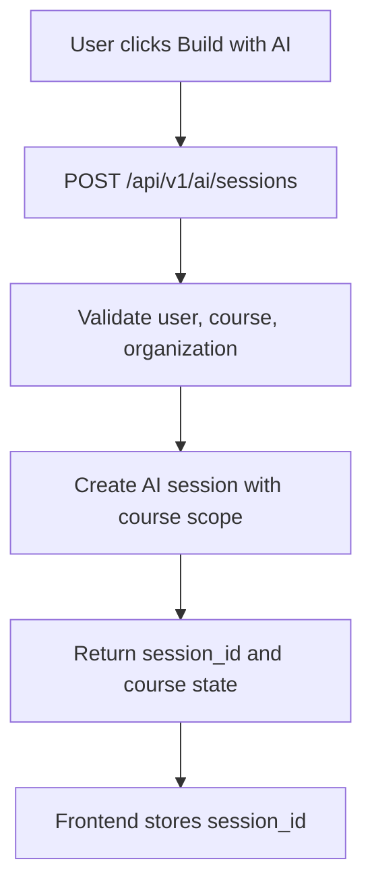

## 2. Page List and Fetch Flow
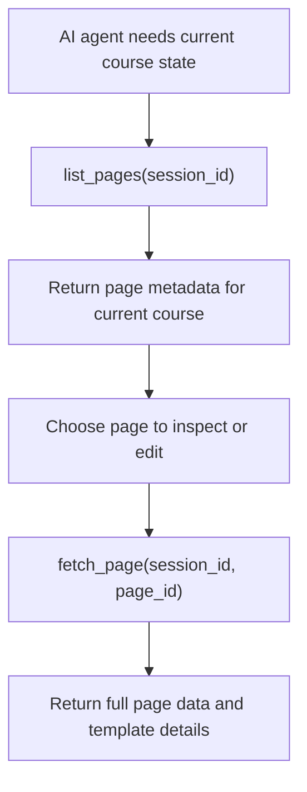

## 3. Create Page Proposal and Apply Flow
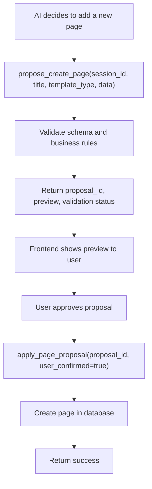

## 4. Update Page Proposal and Apply Flow
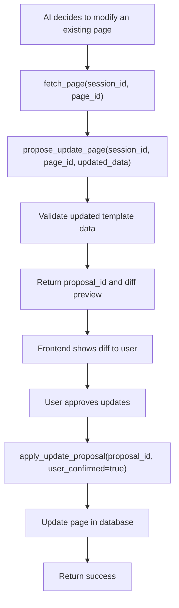

## 5. Delete Page Proposal and Confirm Flow
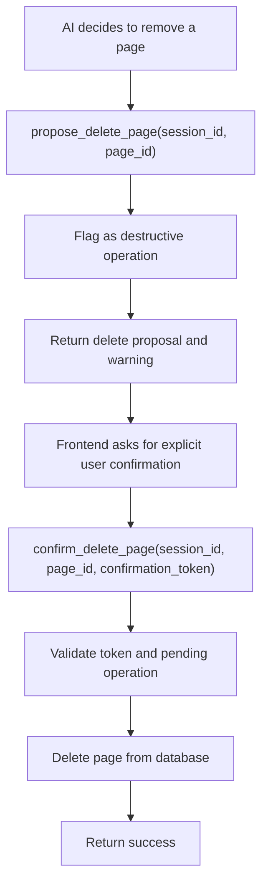

## 6. Course Validation Flow
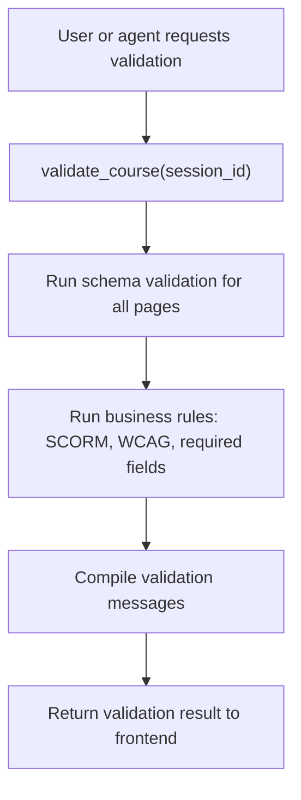

## 7. Similar Course Retrieval Flow
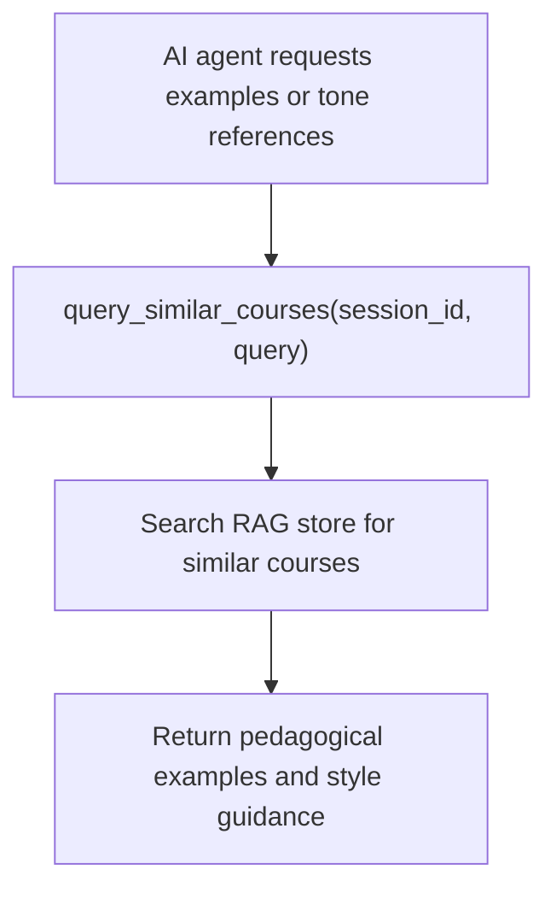

## 8. File Ingestion / Document Import Flow
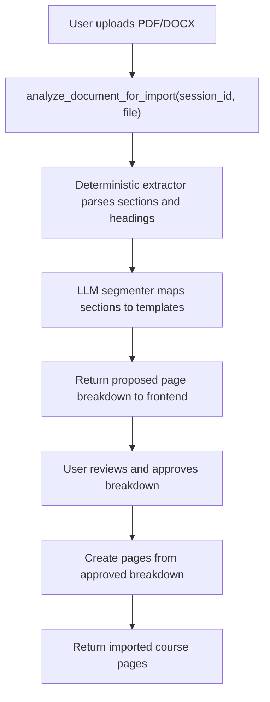

## 9. Simple Chat Edit Scenario Flow
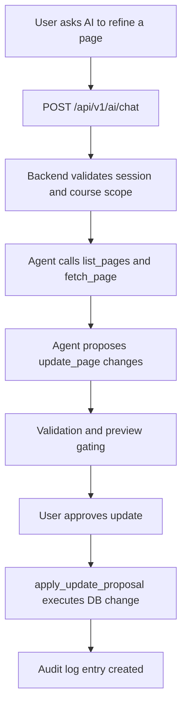

## 10. Full Course from Uploaded File Scenario Flow
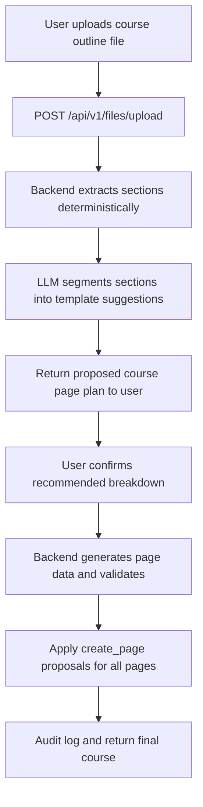

## 11. Destructive Delete Scenario Flow
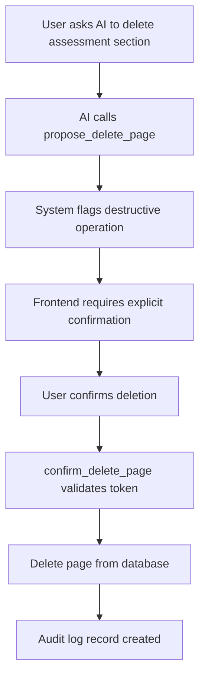

## 12. Propose → Validate → Confirm → Apply Safety Flow
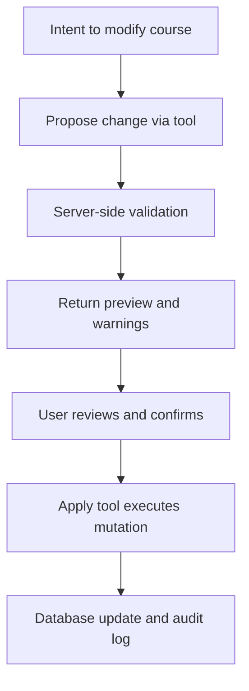
