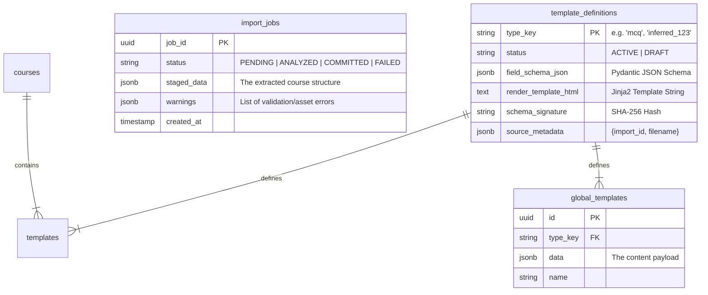

As the **Technical Lead / Architect**, I have updated the BRD to **Version 1.8**.

This version bridges the gap between business intent and engineering execution. It includes:
1.  **Mermaid.js Architecture Diagrams** to visualize the new "Heuristic Import Pipeline".
2.  **Database Schema Definitions** for the new PostgreSQL tables.
3.  **Technical Implementation Guides** attached to every User Story, specifying exactly which libraries (`slimit`, `BeautifulSoup`) and design patterns (Repository, Factory) to use.

This document is now ready to be handed to the engineering team.

```markdown
# Business Requirements Document (BRD)
## Project: eLearning Authoring Platform - Phase 2 (Backend Core)
**Version:** 1.8
**Status:** APPROVED FOR DEVELOPMENT
**Focus:** Legacy Migration, Template Harvesting, SCORM Import (R3)

---

## 1. Executive Summary
This document defines the backend requirements to transform the platform into a "Headless SCORM Engine" capable of **Legacy Migration**. The primary strategic goal is to ingest large volumes of **manually generated legacy courses**, extract their content, and convert them into **Master Data** (Reusable Templates) to accelerate future course production.

## 2. System Architecture & Data Flow

### 2.1 High-Level Architecture (Import Pipeline)
The following diagram illustrates the **Staged Import Workflow** designed to handle large, messy legacy files without blocking the main thread or corrupting the database.

```mermaid
graph TD
    Client[Frontend / API Client]
    
    subgraph "FastAPI Backend"
        API[Import Router]
        Service[Import Service]
        Parser[Heuristic Parser (AST)]
        Rewriter[Asset Rewriter]
        Inferrer[Schema Inference Engine]
    end
    
    subgraph "PostgreSQL Database"
        JobDB[(import_jobs)]
        DefDB[(template_definitions)]
        CourseDB[(courses / templates)]
    end
    
    subgraph "File Storage"
        Temp[/tmp/uploads]
        Media[/app/media]
    end

    Client -- 1. Upload ZIP --> API
    API -- 2. Stream to Disk --> Temp
    API -- 3. Analyze (Async) --> Service
    Service -- 4. Extract & Scan --> Parser
    Parser -- 5. Find JSON Payload --> Inferrer
    Inferrer -- 6. Check Signature --> DefDB
    Inferrer -- 7. Generate Draft Schema --> DefDB
    Service -- 8. Stage Data (JSONB) --> JobDB
    
    Client -- 9. Poll Status / Get Preview --> API
    API -- 10. Read Staged Data --> JobDB
    
    Client -- 11. Commit Import --> API
    API -- 12. Finalize --> Service
    Service -- 13. Move Assets --> Media
    Service -- 14. Rewrite Paths --> Rewriter
    Service -- 15. Persist Course --> CourseDB
```

### 2.2 Database Schema Extensions
To support the dynamic nature of this phase, the following schema changes are required in persisted_course.py.



---

## 3. Functional Requirements

### Module 1: Heuristic Import Service (R3)

| ID | Requirement | Priority | Description |
| :--- | :--- | :--- | :--- |
| **BE-IMP-01** | **Legacy Package Ingestion** | Critical | Accept `.zip` uploads (max 200MB). Support manually created packages lacking `imsmanifest.xml`. |
| **BE-IMP-02** | **Heuristic Data Discovery** | Critical | Scan launch files (e.g., `index.html`) and referenced scripts. **Must support minified code.** Use AST parsing or robust tokenization to locate JSON payloads assigned to variables (e.g., `window.config`, `var courseData`). |
| **BE-IMP-03** | **Multi-Template Extraction** | Critical | Extract ordered array of template objects. Support $1..N$ templates. |
| **BE-IMP-04** | **Smart Matching & Inference** | Critical | 1. Match against known types.<br>2. If unknown, **Infer Schema** and create a **DRAFT** Template Definition.<br>3. **De-duplicate:** If inferred signature matches an existing definition, use the existing one. |
| **BE-IMP-05** | **Strict Asset Scavenging** | High | Recursively scan ZIP for assets. Normalize relative paths (`../../img/logo.png`) to absolute API URLs. **Strict Collision Rule:** If duplicate filenames exist (e.g., two `bg.png` files in different folders), fail the match for that specific asset rather than guessing. |
| **BE-IMP-05-A**| **HTML Content Rewriting** | High | The system must parse HTML strings *inside* JSON fields (e.g., `content: ""`). It must detect and rewrite `src` attributes to point to the new API URL. |
| **BE-IMP-05-B**| **CSS Content Rewriting** | High | The system must parse CSS files and `style` attributes to detect `url('path/to/img.png')` patterns and rewrite them to API URLs. |
| **BE-IMP-06** | **Template Harvesting** | Critical | If `harvest_templates=true`, add imported slides to the Global Library. **Constraint:** Only harvest if the Template Definition is `ACTIVE` (not Draft). |
| **BE-IMP-07** | **Best Effort Import** | High | If specific templates fail validation or parsing, the system must **NOT** rollback the entire course. It must insert a "Placeholder Error Template" containing the raw data and a list of warnings, allowing the user to fix it later. |
| **BE-IMP-08** | **Import Preview API** | Critical | The import process must be asynchronous or staged using the `import_jobs` table.<br>1. `POST /import/analyze` returns a `job_id`.<br>2. `GET /import/{job_id}/preview` returns the list of *extracted* templates from the DB.<br>3. `POST /import/{job_id}/commit` finalizes the persistence. |

### Module 2: Template Management API

| ID | Requirement | Priority | Description |
| :--- | :--- | :--- | :--- |
| **BE-TMP-01** | **Schema Serving** | Critical | Endpoint `GET /templates/definitions/{type}` returns schema. |
| **BE-TMP-02** | **Draft Management** | High | API to list `DRAFT` definitions. Admin must be able to Rename, Edit Schema, and Promote to `ACTIVE`. |
| **BE-TMP-03** | **Draft Traceability** | Medium | When creating a Draft Definition, store `source_metadata` (Import ID, Original Filename, Timestamp) to allow tracking and bulk cleanup of bad imports. |
| **BE-TMP-04** | **Render Template Storage** | Critical | The `template_definitions` table must store a `render_template_html` (Text/Jinja2) column to allow dynamic rendering during export. |
| **BE-TMP-05** | **Generic Render Generation** | High | When inferring a schema (BL-IMP-02), the system must generate a basic HTML layout (e.g., `<div>...</div>`) and save it to `render_template_html`. |

### Module 3: Export Factory Refactoring

| ID | Requirement | Priority | Description |
| :--- | :--- | :--- | :--- |
| **BE-EXP-04** | **Dynamic Rendering** | Critical | The Export Service must be refactored to load the `render_template_html` string from the DB for the specific template type and render it with the template data, replacing the hardcoded `_render_{type}` methods. |

---

## 4. Epics & User Stories (With Technical Implementation Details)

### Epic 1: Heuristic Import Engine (The Core)
**Goal:** Enable the system to read and understand messy, legacy, manually-coded course packages.

#### Story 1.1: Open Package Ingestion
**As a** Content Manager,
**I want** to upload a ZIP file that I manually compressed from a folder of HTML/JS files,
**So that** I can import courses that were never formally exported as SCORM packages.

*   **Acceptance Criteria:**
    *   `Given` a ZIP file > 200MB, `When` I upload it, `Then` the API returns `413 Payload Too Large`.
    *   `Given` a ZIP file containing only `index.html` and `data.js` (no manifest), `When` I upload it, `Then` the system accepts it for processing.
*   **Technical Implementation:**
    *   **Endpoint:** `POST /api/v1/import/analyze` (Async).
    *   **Library:** Use `python-multipart` for upload, `zipfile` for validation.
    *   **Security:** Use `tempfile.TemporaryDirectory` to extract files safely. Ensure `zipfile.extractall` does not allow path traversal (Zip Slip vulnerability).

#### Story 1.2: Heuristic Payload Discovery (Minification Support)
**As a** Developer,
**I want** the system to find the course data even if it's buried in a minified `scripts.min.js` file,
**So that** I don't have to manually un-minify or format legacy code before importing.

*   **Acceptance Criteria:**
    *   `Given` a legacy course where data is defined as `var config={...}` in a 10,000-character single-line file, `When` processed, `Then` the system correctly extracts the JSON object.
    *   `Given` a file with `eval()` or malicious code, `When` processed, `Then` the system **does not execute** the code but statically parses it.
*   **Technical Implementation:**
    *   **Library:** Use `slimit` (lexer) or `esprima-python` to build an Abstract Syntax Tree (AST).
    *   **Logic:** Walk the AST looking for `AssignmentExpression` where the right side is an `ObjectExpression` or `ArrayExpression`.
    *   **Fallback:** If AST fails, use `re` (Regex) to find `var \w+\s*=\s*(\[.*\]|\{.*\})`.

#### Story 1.3: Strict Asset Normalization (HTML & CSS)
**As a** System Architect,
**I want** the import process to fail gracefully when asset filenames are ambiguous (duplicates),
**So that** we don't accidentally show the wrong image in a course module.

*   **Acceptance Criteria:**
    *   `Given` a ZIP with `module1/img.png` and `module2/img.png`, `When` the JSON references just `img.png`, `Then` the system logs a warning "Ambiguous Asset" and does **not** rewrite the path.
    *   `Given` a JSON field containing HTML ``, `When` imported, `Then` the `src` is rewritten to `/api/v1/media/{course_id}/{uuid}`.
*   **Technical Implementation:**
    *   **Library:** Use `BeautifulSoup4` (`bs4`) for HTML parsing.
    *   **Logic:** Create a `FileMap` dictionary `{filename: [list_of_paths]}`. If `len(list_of_paths) > 1`, mark as ambiguous.
    *   **Storage:** Use the `StorageService` abstraction (see NFRs) to save files to disk or S3.

---

### Epic 2: Template Harvesting & Master Data
**Goal:** Convert imported legacy content into reusable assets for future course creation.

#### Story 2.1: Schema Inference & Draft Creation
**As an** Admin,
**I want** the system to automatically create "Draft" definitions for unknown template types,
**So that** I can review and promote them to "Master Data" later without writing SQL manually.

*   **Acceptance Criteria:**
    *   `Given` an imported template with a unique structure never seen before, `When` analyzed, `Then` a new `TemplateDefinition` is created with status `DRAFT`.
    *   `Given` an imported template that matches an existing `schema_signature`, `When` analyzed, `Then` **NO** new definition is created; the existing one is used.
*   **Technical Implementation:**
    *   **Hashing:** `hashlib.sha256(json.dumps(sorted_keys)).hexdigest()`.
    *   **Inference:** Map Python types to JSON Schema: `str` -> `text`, `bool` -> `boolean`, `list` -> `array`.
    *   **Render Gen:** Use `jinja2.Template` to create a default string: `<ul><li>{{k}}: {{v}}</li></ul>`.

#### Story 2.2: Template Harvesting
**As a** Content Creator,
**I want** imported slides to be added to my Global Library,
**So that** I can drag-and-drop that specific "Safety Video" slide into a new course I'm building.

*   **Acceptance Criteria:**
    *   `Given` the import flag `harvest_templates=true`, `When` the import commits, `Then` the individual templates are saved to the `global_templates` table.
*   **Technical Implementation:**
    *   **Database:** Insert into `global_templates` table.
    *   **Constraint:** Check `template_definition.status == 'ACTIVE'` before inserting.

---

### Epic 3: Import Workflow & Review
**Goal:** Provide a safe, transparent user experience for complex imports.

#### Story 3.1: Import Preview API (PostgreSQL Backed)
**As a** User,
**I want** to see a report of what *will* be imported before it is saved to the database,
**So that** I can cancel the import if the system misidentified the data or found too many errors.

*   **Acceptance Criteria:**
    *   `Given` a valid ZIP, `When` I call `POST /analyze`, `Then` I receive a `job_id`.
    *   `Given` a `job_id`, `When` I call `GET /preview`, `Then` I see a JSON list of 50 templates, including their inferred types and any validation warnings.
    *   `Given` a preview I am happy with, `When` I call `POST /commit`, `Then` the data is actually written to the `courses` table.
*   **Technical Implementation:**
    *   **Model:** `ImportJob` (SQLAlchemy).
    *   **Columns:** `staged_data` (JSONB), `warnings` (JSONB), `status` (Enum: PENDING, ANALYZED, COMMITTED).
    *   **Flow:** `analyze` writes to `staged_data`. `commit` reads `staged_data` and writes to `CourseRecord`.

---

## 5. Non-Functional Requirements (NFR)

1.  **Security:** **NO EVAL.** The parser must never execute the JavaScript found in the ZIP.
2.  **Tech Stack:** JavaScript parsing must be performed using a **pure-Python library** (e.g., `slimit`, `pyjsparser`, or `esprima-python`) to avoid requiring Node.js in the backend container. Regex fallbacks are permitted only for simple variable extraction.
3.  **Performance:** Parsing 200MB / 500 assets < 30 seconds.
4.  **Reliability:** If Heuristics fail (no data found), return a specific error code `ERR_NO_PAYLOAD_FOUND`.
5.  **Storage Abstraction:** Asset storage must use an **Abstract Base Class** (`StorageService`), allowing switching between `LocalStorage` (dev) and `S3/BlobStorage` (prod) via environment variables.

---

## 6. Acceptance Criteria (System Level)
1.  **Minified Import:** A course with `scripts.min.js` containing the data payload imports successfully.
2.  **Preview Flow:** A user can upload a ZIP, see a JSON preview of the 50 extracted slides (including 2 errors), and then click "Commit" to save the 48 valid slides and 2 error placeholders.
3.  **No Duplicates:** Importing the same legacy course twice results in **zero** new Template Definitions created on the second run.
4.  **Draft Safety:** A newly inferred template type appears in the "Drafts" list for Admins but is **not** visible in the standard "Add Slide" menu for Creators until approved.
```