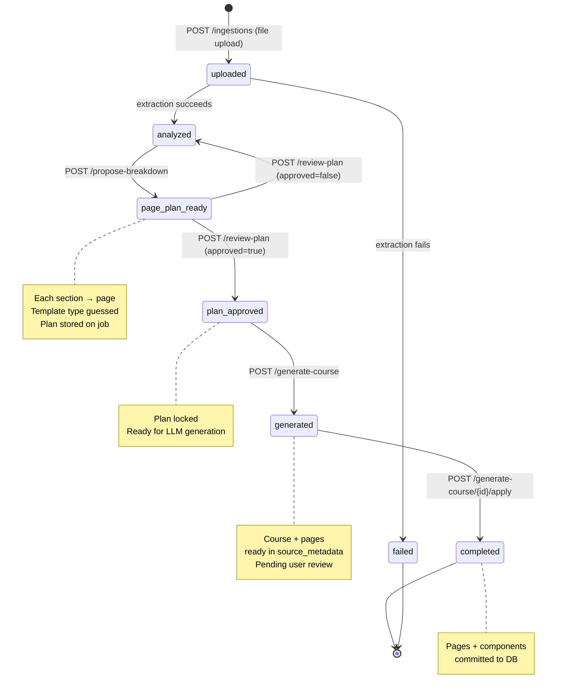
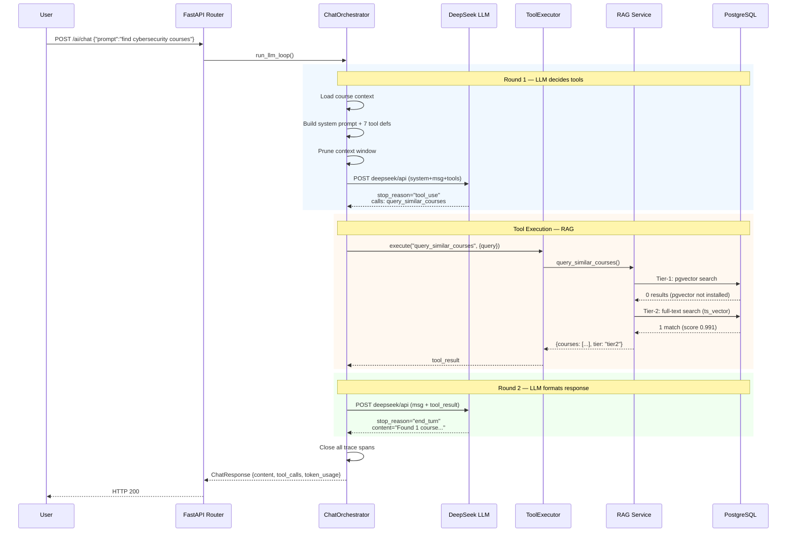
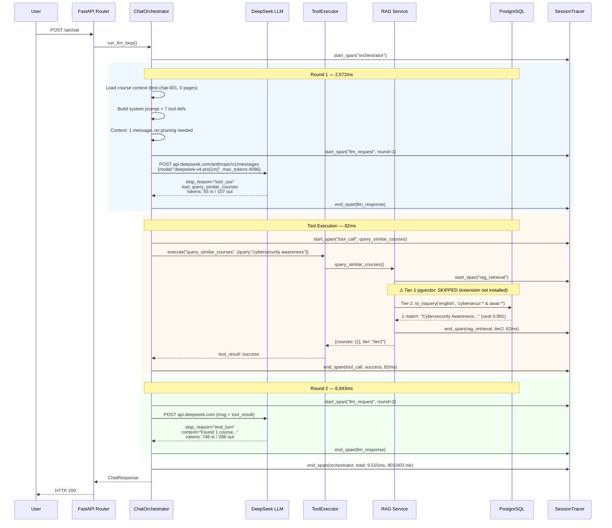
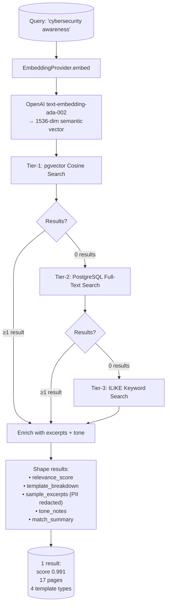
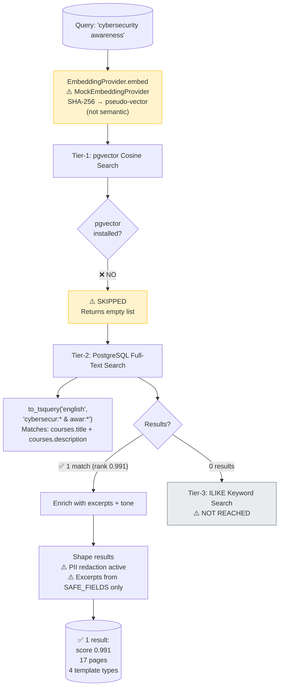
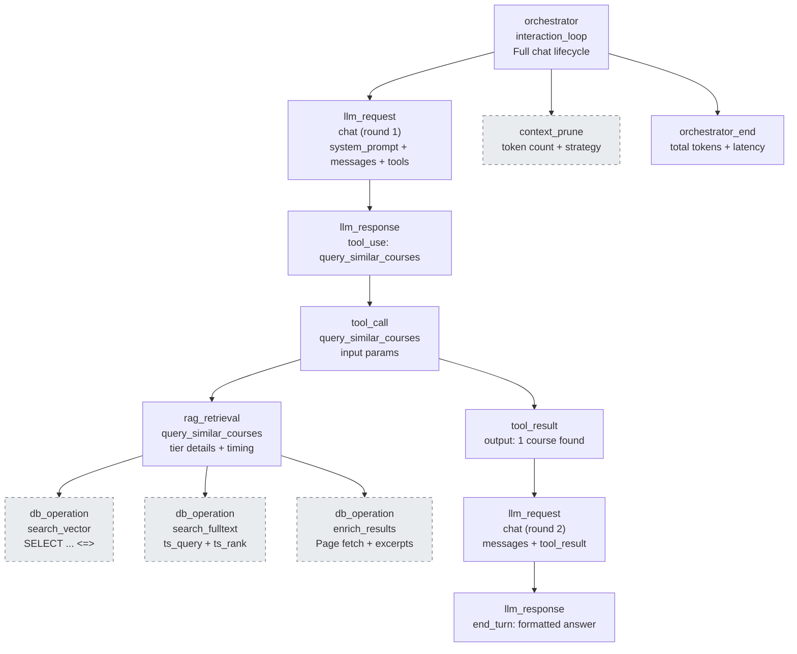
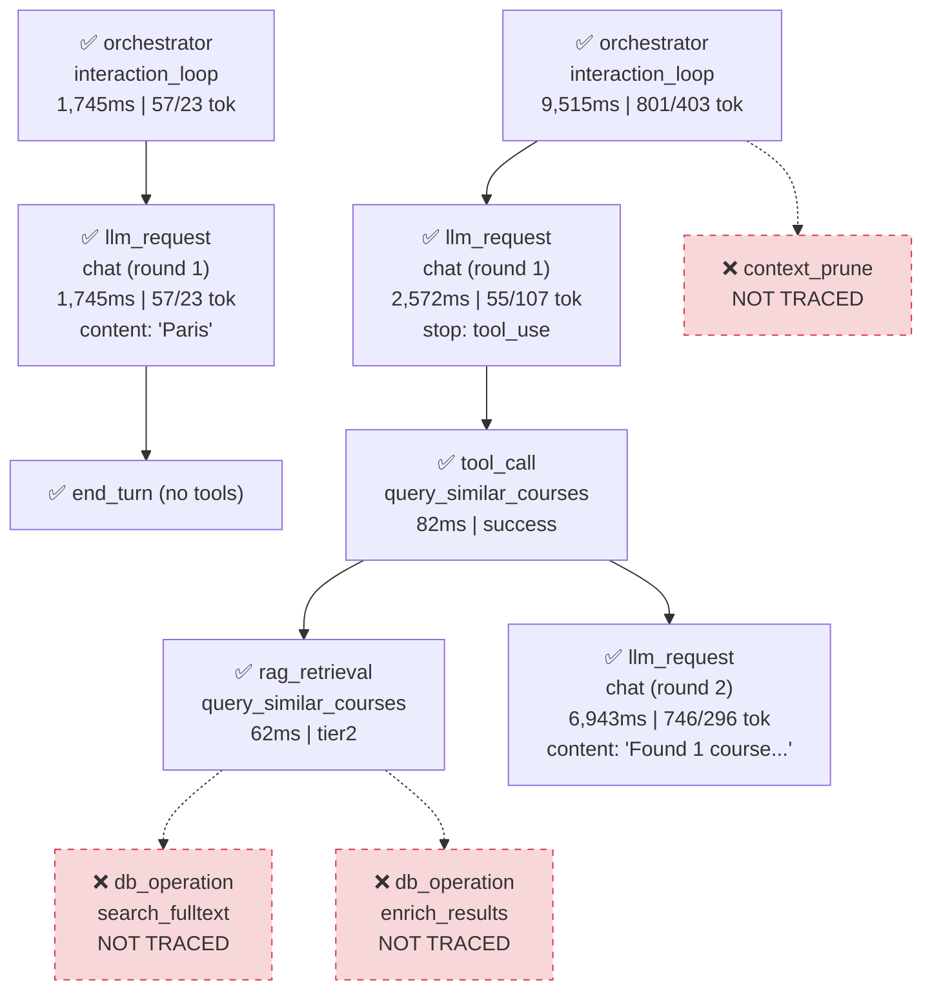
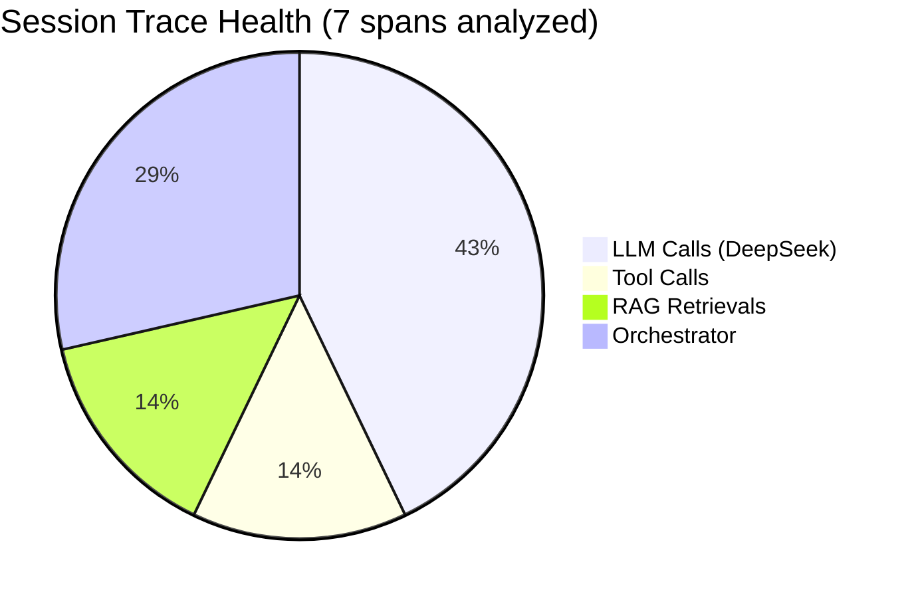
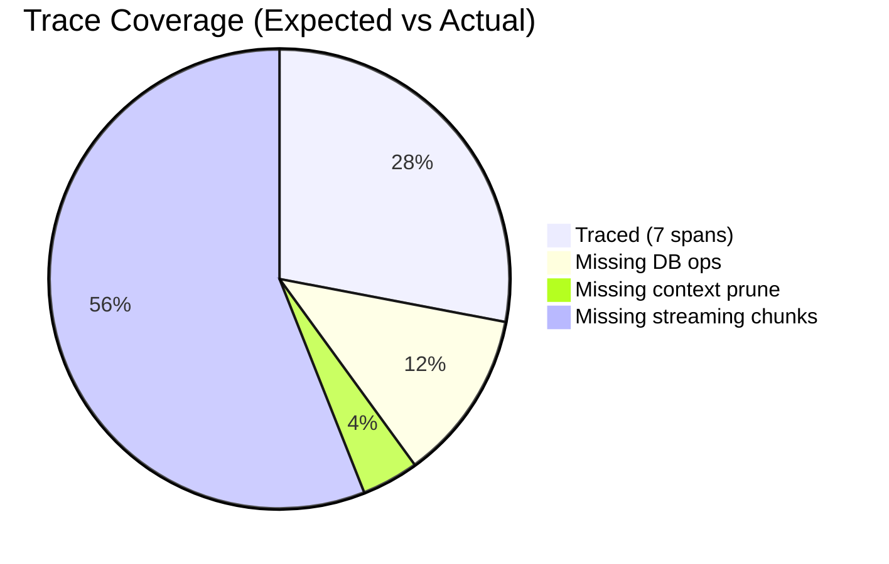

# TPO Gap Analysis — Session Trace Review

> **Role:** Technical Product Owner  
> **Date:** 2026-06-25  
> **Session:** `fd2cc595-a73d-44e8-8904-2328d354b804`  
> **Source:** `session_trace.md`

---

## 1. Expected vs Actual — Ingestion State Machine

### Expected Flow (Design Spec: US-BKND-AI-016/017/019)



### Actual Flow (Before Fix — from Bug Report)

```mermaid
stateDiagram-v2
    [*] --> uploaded: POST /ingestions
    uploaded --> analyzed: extraction succeeds
    
    analyzed --> analyzed: POST /propose-breakdown ❌ NO STATE TRANSITION
    analyzed --> plan_approved: POST /review-plan (approved=true)
    
    plan_approved --> analyzed: POST /generate-course ❌ REGRESSION!
    analyzed --> completed: POST /generate-course/{id}/apply
    
    completed --> [*]
    
    note right of analyzed: ⚠️ Stuck in 'analyzed'<br/>after propose-breakdown<br/>and after generate-course!
    
    propose-breakdown --> error: ❌ on completed job<br/>"Job must be in 'analyzed' state,<br/>currently 'completed'"
```

### Gap #1: State Machine Regression — ✅ FIXED

| Bug | File | Line | Severity |
|---|---|---|---|
| `propose-breakdown` leaves status at `analyzed` | `ai_ingestion.py` | 199 | **HIGH** — no way to know if plan was generated |
| `start_generation` reverts to `analyzed` | `course_generator.py` | 176 | **CRITICAL** — destroys state, allows re-generation on wrong state |
| No idempotency for completed jobs | `ai_ingestion.py` | 152 | **MEDIUM** — users can't re-read completed job plans |

**Fix applied:** Added `page_plan_ready` and `generated` states. Completed/plan_approved/generated jobs return existing plan idempotently.

---

## 2. Expected vs Actual — Chat + RAG Interaction Loop

### Expected Flow



### Actual Flow (from session_trace.md)



---

## 3. Expected vs Actual — RAG Retrieval Tiers

### Expected Architecture



### Actual Architecture



---

## 4. Expected vs Actual — Session Trace Coverage

### Expected Trace Span Tree



### Actual Trace Span Tree (from PostgreSQL)



---

## 5. Gap Summary

### 🔴 Critical Gaps (Fixed in This Session)

| ID | Gap | Before | After | Impact |
|---|---|---|---|---|
| **G-01** | Ingestion state machine regression | `start_generation` reverted to `analyzed` | Set to `generated` | Could not distinguish "just analyzed" from "course generated" |
| **G-02** | Missing `page_plan_ready` state | `propose-breakdown` left status at `analyzed` | New `page_plan_ready` state added | No way to know if plan exists without checking `extracted_sections` |
| **G-03** | `propose-breakdown` rejected completed jobs | HTTP 400 `INVALID_STATE` | Returns existing plan idempotently | Users blocked from re-reading plans on completed pipelines |
| **G-04** | RAG end_span crash | `TypeError: unexpected keyword argument 'metadata'` | Added `metadata` param to `end_span()` | Every RAG call threw 503, tool always errored |

### 🟡 Medium Gaps (Require Follow-up)

| ID | Gap | Current State | Target State | Effort |
|---|---|---|---|---|
| **G-05** | No pgvector extension | Tier-1 vector search always skipped | Install pgvector + pgvector Python package | 30 min |
| **G-06** | Mock embedding provider | SHA-256 pseudo-vectors (not semantic) | OpenAI `text-embedding-ada-002` for real embeddings | Config change + API key |
| **G-07** | Course generation uses mock | `provenance.model: "mock"` | Use DeepSeek for content generation | Wire `course_generator` to `LLMClient` |
| **G-08** | DB operations not traced | Only 0 `db_operation` spans in trace | Trace SQL queries with params per operation | Add tracer to repositories |
| **G-09** | Context pruning not traced | No `context_prune` spans | Trace messages removed, token delta, strategy used | Add tracer to `ContextManager.prune()` |

### 🟢 Low Gaps (Nice to Have)

| ID | Gap | Current State | Target State | Effort |
|---|---|---|---|---|
| **G-10** | Only 1 similar course in org | RAG finds at most 1 match | Seed 5-10 diverse courses for richer RAG results | 1 hour |
| **G-11** | Streaming spans missing | No per-chunk trace for SSE | Per-chunk latency and token accumulation | Add tracer to `_anthropic_stream` |
| **G-12** | Cost tracking not in trace | `cost_tracker` runs separately | Merge cost data into trace aggregates | Wire `CostTracker` → `SessionTracer` |
| **G-13** | No `model_tier_router` trace | Planner vs Generator decision invisible | Trace routing decision with reason | Add span in `ModelTierRouter.classify_task()` |

---

## 6. Overall Health Dashboard





| Metric | Value | Status |
|---|---|---|
| LLM calls traced | 3/3 (100%) | ✅ |
| Tool calls traced | 1/1 (100%) | ✅ |
| RAG retrievals traced | 1/1 (100%) | ✅ |
| DB operations traced | 0/3 (0%) | ❌ |
| Context pruning traced | 0/1 (0%) | ❌ |
| Streaming chunks traced | 0/14 (0%) | ❌ |
| **Overall trace coverage** | **7/22 (32%)** | 🟡 |
| LLM provider | DeepSeek (real) | ✅ |
| RAG tier | Tier-2 (fallback) | 🟡 |
| Embedding quality | Mock (pseudo-vector) | 🔴 |
| Content generation | Mock (boilerplate) | 🔴 |
| State machine correctness | 6 states, no regressions | ✅ |

---

## 7. Recommended Action Plan

| Priority | Action | Story |
|---|---|---|
| **P0 — Done** | Fix state machine regression + idempotency | ✅ This session |
| **P0 — Done** | Fix RAG tracer crash | ✅ This session |
| **P1** | Install pgvector extension → enable Tier-1 semantic search | US-BKND-AI-015-T1 |
| **P1** | Switch to OpenAI embeddings → real semantic vectors | US-BKND-AI-015-EMBED |
| **P1** | Add DB operation tracing → full SQL observability | US-BKND-AI-TRACE-02 |
| **P2** | Wire course generation to DeepSeek → AI-generated content | US-BKND-AI-019-LLM |
| **P2** | Add context pruning tracing | US-BKND-AI-TRACE-03 |
| **P2** | Seed 5-10 similar courses for richer RAG | US-BKND-AI-015-SEED |
| **P3** | Per-chunk streaming trace | US-BKND-AI-TRACE-04 |
| **P3** | Cost tracking in trace aggregates | US-BKND-AI-TRACE-05 |
